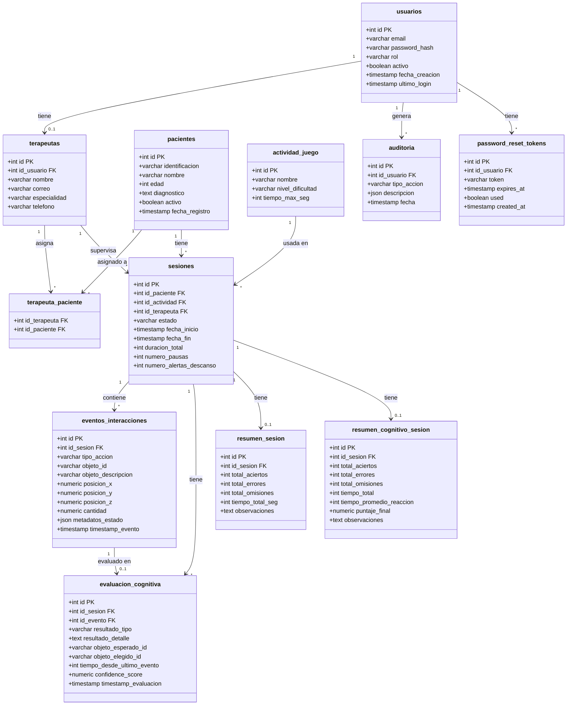

 **Requerimientos para el proyecto de videojuego en realidad virtual (Cerebro al fuego)**

1. ## **Introducción**

El presente documento reúne y especifica los requerimientos funcionales y no funcionales del proyecto “Cerebro al Fuego”, un videojuego inmersivo desarrollado en realidad virtual (VR) cuyo propósito es diseñar un programa de estimulación cognitivas a través de actividades de cocina simuladas en un entorno 3D.

El proyecto surge de la necesidad de contar con herramientas tecnológicas que permitan  estimular la reserva cognitiva y objetivar el desempeño funcional de adultos mayores en Actividades Instrumentales de la Vida Diaria (AIVD) garantizando altos niveles de validez ecológica. Para tal fin, el videojuego recrea una cocina típica colombiana, con mobiliario, utensilios y distribución culturalmente reconocibles, de modo que los participantes perciban el entorno como auténtico, cotidiano y natural.

El sistema incorpora además un módulo administrativo para terapeutas y un módulo especializado para el seguimiento de pacientes, permitiendo gestionar sesiones, almacenar información y analizar resultados de manera estructurada y segura.

Los requerimientos aquí descritos establecen la estructura fundamental del videojuego, sus reglas de interacción, sus limitaciones, los niveles y actividades disponibles, así como las funciones administrativas relacionadas con la gestión de usuarios, pacientes, seguridad y auditoría. Este documento sirve como guía base para el desarrollo en Unity, garantizando claridad, trazabilidad y alineación con los objetivos clínicos y tecnológicos del proyecto.

2. ## **Propósito**

El propósito de este documento es definir, organizar y formalizar todos los requerimientos necesarios para el diseño, desarrollo e implementación del videojuego “Cerebro al Fuego” en la plataforma Unity. Está dirigido al equipo de desarrollo de software, equipo de modelado 3D, investigadores principales y terapeutas que participarán en el proceso de validación y uso del sistema.

Este documento busca:

* Establecer de manera clara los requerimientos funcionales y no funcionales del sistema.

* Proporcionar una referencia única y verificable para todos los equipos involucrados.

* Asegurar que el desarrollo cumpla con estándares técnicos, clínicos y de validez ecológica.

* Facilitar la comunicación entre áreas técnicas y áreas clínicas.

* Definir criterios de aceptación y límites operativos.

Con esta documentación se garantiza que las necesidades del proyecto sean entendidas de forma homogénea, evitando ambigüedades y asegurando coherencia durante todo el ciclo de desarrollo.

3. ## **ESTRUCTURA DEL CÓDIGO DE REQUERIMIENTO**

**\[RF/RN \- MM \- NN\]**

RF/NN: Identificación del tipo de requerimiento, donde:

* RF \= Requerimiento funcional.  
* RN \= Requerimiento no funcional.  
* NN \= Refiriéndose al número del requerimiento.

MM: Sufijo del módulo al que pertenece, por ejemplo:

* SEG \= Requerimiento funcional \- creación del superusuario \- 01(RF \- SEG \- 01),  
* UNT \= Requerimiento funcional \- estructura de niveles \- 02 (RF \- UNT \- 02).  
* El sufijo SEG hace referencia a los requerimientos del módulo de seguridad y el sufijo UNT hace referencia a los requerimientos del módulo Unity.

4. ## **REQUERIMIENTOS FUNCIONALES**

**REQUERIMIENTOS FUNCIONALES \- MÓDULO DE SEGURIDAD**

| Título del Requerimiento | Creación y configuración del Superusuario (Superadministrador) |  |  |  |  |  |
| :---- | :---- | :---- | :---- | :---- | :---- | :---- |
| **Código de identificación** | RF \- SEG \- 01 |  |  |  |  |  |
| **Tipo de requerimiento** | Funcional (x) |  |  | No Funcional () |  |  |
| **Versión** | 1.0 |  |  |  |  |  |
| **Fuente** | Análisis del documento *“Cerebro al fuego”* y definición de jerarquía administrativa del sistema. |  |  |  |  |  |
| **Descripción** | El sistema debe permitir la creación inicial de un usuario con rol **Superadministrador**, que tendrá acceso total a todas las funciones del sistema: creación y eliminación de terapeutas, gestión global de pacientes, configuración del sistema y auditoría. La creación del superusuario solo podrá realizarse **una vez** durante la instalación o inicialización del sistema y quedará registrado como cuenta raíz. Esta cuenta podrá acceder mediante credenciales robustas (usuario \+ contraseña) y será la única capaz de gestionar otros administradores o terapeutas. |  |  |  |  |  |
| **Justificación** |  Es necesario un rol principal con privilegios totales para garantizar control jerárquico, seguridad del sistema y trazabilidad de acciones administrativas. Sin este rol, no habría control central sobre usuarios y datos sensibles. |  |  |  |  |  |
| **Precondiciones** | El sistema debe estar instalado y en modo configuración inicial. Debe existir conexión con la base de datos. No debe haber otro superusuario registrado. |  |  |  |  |  |
| **Restricciones** | Solo puede existir un superusuario activo. La eliminación del superusuario está prohibida por diseño. Las credenciales de superusuario no pueden ser modificadas por ningún otro usuario. |  |  |  |  |  |
| **Prioridad** | Alta(X) |  | Media () |  | Baja () |  |
| **Dificultad** | Alta() |  | Media () |  | Baja () |  |
| **Dependencia** | \- |  |  |  |  |  |
| **Actores** |  Instalador del sistema, Superadministrador, Sistema. |  |  |  |  |  |
| **Entradas** | Datos de registro: nombre, correo institucional, contraseña segura. Token de validación o clave de instalación. |  |  |  |  |  |
| **Proceso** | Durante la primera ejecución, el sistema solicita los datos para crear el Superadministrador. Valida la contraseña según políticas (mínimo 10 caracteres, mayúsculas, minúsculas, número, símbolo). Genera registro en la base de datos cifrado. Asigna permisos globales y crea un registro de auditoría “Superusuario creado”. |  |  |  |  |  |
| **Salida** |  Cuenta de Superadministrador activa y credenciales guardadas de forma cifrada. |  |  |  |  |  |
| **Postcondiciones** | El sistema queda bloqueado para creación de nuevos superusuarios. Las credenciales permiten acceso a todas las funciones del sistema. |  |  |  |  |  |
| **Criterios de aceptación** | Solo se puede crear un superusuario. El acceso es exitoso y los permisos se aplican a todos los módulos. El evento de creación queda registrado en los logs. |  |  |  |  |  |
| **Requerimientos no funcionales** |  |  |  |  |  |  |
| **Estado** | Aprobado(x ) | Rechazado() |  | Pendiente () |  | Corregir() |
| **Observaciones** |  |  |  |  |  |  |

| Título del Requerimiento | Gestión de roles y permisos del Superadministrador |  |  |  |  |  |
| :---- | :---- | :---- | :---- | :---- | :---- | :---- |
| **Código de identificación** | RF \- SEG \-02 |  |  |  |  |  |
| **Tipo de requerimiento** | Funcional (x) |  |  | No Funcional |  |  |
| **Versión** | 1.0 |  |  |  |  |  |
| **Fuente** | Lógica jerárquica del sistema y análisis del flujo de administración del documento *“Cerebro al fuego”*. |  |  |  |  |  |
| **Descripción** | El Superadministrador tendrá la capacidad de gestionar completamente el sistema. Esto incluye: Crear credenciales de nuevos terapeutas. Editar estado de terapeutas existentes (activo o inactivo). Asignar pacientes a terapeutas o reasignarlos. Modificar información general de los terapeutas (nombre, correo, estado activo/inactivo). Consultar información y reportes de todos los pacientes del sistema. Gestionar parámetros globales de seguridad y configuración. |  |  |  |  |  |
| **Justificación** | Garantiza el control centralizado del entorno terapéutico, la correcta asignación de pacientes y la administración de cuentas bajo supervisión. |  |  |  |  |  |
| **Precondiciones** | Superadministrador autenticado en el sistema. Módulo de base de datos y autenticación operativos. |  |  |  |  |  |
| **Restricciones** | Solo el Superadministrador puede crear o eliminar terapeutas. Los terapeutas no pueden modificar la lista de otros terapeutas ni reasignar pacientes. No se pueden eliminar terapeutas si tienen pacientes activos asignados (se debe reasignar primero). |  |  |  |  |  |
| **Prioridad** | Alta(X) |  | Media () |  | Baja () |  |
| **Dificultad** | Alta() |  | Media () |  | Baja () |  |
| **Dependencia** | RF-SEG-01 |  |  |  |  |  |
| **Actores** | Superadministrador, Sistema. |  |  |  |  |  |
| **Entradas** | Datos del terapeuta (nombre, usuario, contraseña temporal, correo). Información de pacientes y asignaciones. |  |  |  |  |  |
| **Proceso** | El Superadministrador ingresa a la interfaz de administración. Selecciona “Crear terapeuta” o “Modificar terapeuta”. El sistema valida campos y guarda el registro. Puede asignar pacientes a otro terapeuta mediante menú desplegable. El sistema genera logs por cada acción administrativa. |  |  |  |  |  |
| **Salida** | Terapeutas creados o modificados, pacientes asignados, registros de auditoría actualizados. |  |  |  |  |  |
| **Postcondiciones** | Nuevos terapeutas activos y con acceso limitado a sus pacientes. Todas las acciones del Superadministrador quedan registradas. |  |  |  |  |  |
| **Criterios de aceptación** | El Superadministrador puede ver, crear, editar y eliminar terapeutas. Solo él puede reasignar pacientes entre terapeutas. Los cambios son visibles de inmediato en la base de datos. |  |  |  |  |  |
| **Requerimientos no funcionales** | Operaciones de creación/modificación en menos de 5 segundos. Interfaz responsiva con texto claro (24 pt o más). Confirmaciones visuales y auditivas para acciones críticas. |  |  |  |  |  |
| **Estado** | Aprobado( ) | Rechazado() |  | Pendiente (x) |  | Corregir() |
| **Observaciones** |  |  |  |  |  |  |

| Título del Requerimiento | Gestión de roles y permisos del Terapeuta |  |  |  |  |  |
| :---- | :---- | :---- | :---- | :---- | :---- | :---- |
| **Código de identificación** | RF \-SEG \- 03 |  |  |  |  |  |
| **Tipo de requerimiento** | Funcional (x) |  |  | No Funcional () |  |  |
| **Versión** | 1.0 |  |  |  |  |  |
| **Fuente** | Modelo jerárquico del sistema basado en el documento *“Cerebro al fuego”* y análisis de uso clínico. |  |  |  |  |  |
| **Descripción** | El terapeuta es el rol intermedio encargado de administrar y realizar seguimiento a sus pacientes. El sistema debe permitirle: Registrar nuevos pacientes en el sistema. Editar la información de los pacientes (estado activo/inactivo, edad, DCLA asociado). Consultar los informes de desempeño cognitivo generados por las sesiones de cada paciente. No podrá eliminar pacientes ni acceder a los pacientes de otros terapeutas. |  |  |  |  |  |
| **Justificación** | Define los permisos operativos para los terapeutas, garantizando autonomía clínica sin comprometer la seguridad o la privacidad de otros pacientes. |  |  |  |  |  |
| **Precondiciones** | Terapeuta autenticado con credenciales válidas. Pacientes asignados. |  |  |  |  |  |
| **Restricciones** | Solo puede editar información de pacientes que le estén asignados. No puede modificar informes de resultados (solo verlos). |  |  |  |  |  |
| **Prioridad** | Alta(X) |  | Media () |  | Baja () |  |
| **Dificultad** | Alta() |  | Media () |  | Baja () |  |
| **Dependencia** | RF-SEG-01, RF-SEG-02 |  |  |  |  |  |
| **Actores** | Terapeuta, Sistema, Paciente. |  |  |  |  |  |
| **Entradas** | Datos del paciente (nombre, edad, DCLA, estado). Credenciales del terapeuta. |  |  |  |  |  |
| **Proceso** | El terapeuta accede al panel principal. Selecciona “Registrar paciente” o “Editar paciente”. Introduce los datos requeridos. El sistema guarda cambios en la base de datos. El terapeuta puede acceder a informes de sus pacientes. |  |  |  |  |  |
| **Salida** | Pacientes registrados o actualizados, visualizar informes. |  |  |  |  |  |
| **Postcondiciones** | Paciente activo o inactivo según registro. Los datos modificados se reflejan inmediatamente. |  |  |  |  |  |
| **Criterios de aceptación** | El terapeuta solo ve a sus pacientes. Puede activar/desactivar pacientes desde su panel. Puede abrir informes pero no modificarlos. |  |  |  |  |  |
| **Requerimientos no funcionales** | Interfaz con texto grande y botones accesibles (mínimo 3x3 cm en VR). Latencia en carga de informes \< 3 s. |  |  |  |  |  |
| **Estado** | Aprobado(x ) | Rechazado() |  | Pendiente () |  | Corregir() |
| **Observaciones** |  Agregar filtros en la interfaz para ordenar pacientes por nombre o estado (activo/inactivo). |  |  |  |  |  |

| Título del Requerimiento | Interfaz visual del terapeuta para gestión de pacientes e informes |  |  |  |  |  |
| :---- | :---- | :---- | :---- | :---- | :---- | :---- |
| **Código de identificación** | RF \- SEG \- 04 |  |  |  |  |  |
| **Tipo de requerimiento** | Funcional (x) |  |  | No Funcional () |  |  |
| **Versión** | 1.0 |  |  |  |  |  |
| **Fuente** | Requerimiento derivado del documento *“Cerebro al fuego”* (panel de administración e informes de resultados). |  |  |  |  |  |
| **Descripción** | El sistema debe incluir una **interfaz visual específica para el terapeuta**, donde pueda: Ver la **lista completa de pacientes asignados**. Usar filtros (activo/inactivo, nombre, fecha de última sesión). Presionar un botón **“Ver informe del paciente”** que abra una nueva ventana o panel con información detallada del paciente. Datos generales del paciente. Listado de sesiones realizadas (fecha, duración, actividad, resultado). Puntaje obtenido y observaciones por sesión. |  |  |  |  |  |
| **Justificación** | Centraliza la información clínica en una interfaz intuitiva, permitiendo seguimiento cognitivo eficaz y trazabilidad de la evolución de cada paciente. |  |  |  |  |  |
| **Precondiciones** | Terapeuta autenticado y con pacientes asignados. Sesiones registradas previamente por el sistema. |  |  |  |  |  |
| **Restricciones** | El terapeuta no puede modificar los resultados, solo visualizarlos. Los informes no pueden exportarse sin autorización del Superadministrador. |  |  |  |  |  |
| **Prioridad** | Alta(X) |  | Media () |  | Baja () |  |
| **Dificultad** | Alta() |  | Media () |  | Baja () |  |
| **Dependencia** | RF-SEG-01, RF-SEG-03 |  |  |  |  |  |
| **Actores** | Terapeuta, Sistema. |  |  |  |  |  |
| **Entradas** | Lista de pacientes asignados al terapeuta. Información de sesiones registradas |  |  |  |  |  |
| **Proceso** | El terapeuta abre la pestaña “Pacientes”. El sistema muestra una tabla/listado con sus pacientes. Cada fila incluye: nombre del paciente, estado, fecha última sesión y botón “Ver informe”. Al hacer clic en “Ver informe”, se abre nueva ventana con detalles de sesiones. El terapeuta puede navegar entre sesiones individuales. |  |  |  |  |  |
| **Salida** | Visualización del informe completo del paciente por sesión. |  |  |  |  |  |
| **Postcondiciones** | El terapeuta puede revisar y comparar sesiones históricas. La interfaz mantiene registros en solo lectura. |  |  |  |  |  |
| **Criterios de aceptación** | La lista de pacientes se carga correctamente con filtros funcionales. Al presionar “Ver informe”, se abre la ventana detallada. Los resultados son exactos y coinciden con la información de la base de datos. |  |  |  |  |  |
| **Requerimientos no funcionales** | Carga de la lista \< 5 s. Navegación fluida y texto mínimo de 22 pt. Colores suaves y contraste alto (diseño accesible). |  |  |  |  |  |
| **Estado** | Aprobado(x ) | Rechazado() |  | Pendiente () |  | Corregir() |
| **Observaciones** |  |  |  |  |  |  |

**REQUERIMIENTOS FUNCIONALES \- MÓDULO UNITY**

| Título del Requerimiento | Estructura de niveles y actividades (mapeo 3 niveles × 3 actividades) |  |  |  |  |  |
| :---- | :---- | :---- | :---- | :---- | :---- | :---- |
| **Código de identificación** | RF \- UNT \- 01 |  |  |  |  |  |
| **Tipo de requerimiento** | Funcional (x) |  |  | No Funcional () |  |  |
| **Versión** | 1.0 |  |  |  |  |  |
| **Fuente** | Documento de proyecto (Nivel Fácil, Nivel Intermedio, Nivel Difícil) |  |  |  |  |  |
| **Descripción** | El videojuego tendrá una escena principal tipo con 9 bloques (3 por nivel). Cada bloque corresponde a una actividad concreta (ver lista de actividades provista). Los niveles se estructuran: Nivel Fácil: 3 actividades (cada actividad con 3–5 ingredientes) Nivel Intermedio: 3 actividades (6–10 ingredientes) Nivel Difícil: 3 actividades (11–15 ingredientes) La navegación debe permitir seleccionar un bloque y entrar a la actividad correspondiente; al terminar una actividad mostrar pantalla de resultados y volver al inicio. |  |  |  |  |  |
| **Justificación** | Estructura solicitada por el proyecto para medir desempeño por complejidad y para evaluación escalonada. |  |  |  |  |  |
| **Precondiciones** | Paciente registrado por el terapeuta y en estado activo. |  |  |  |  |  |
| **Restricciones** | La lista de ingredientes por actividad se mostrará una única vez al inicio de la actividad.  No se deben mostrar indicadores de ayuda para localizar ingredientes. |  |  |  |  |  |
| **Prioridad** | Alta(X) |  | Media () |  | Baja () |  |
| **Dificultad** | Alta() |  | Media () |  | Baja () |  |
| **Dependencia** | RF-SEG-03, RF-UNT-06, RF-UNT-10 |  |  |  |  |  |
| **Actores** | Terapeuta, paciente, Sistema |  |  |  |  |  |
| **Entradas** | Selección de de nivel (actividad) |  |  |  |  |  |
| **Proceso** | Pantalla de selección de nivel   Detectar selección  Cargar escena de actividad con assets específicos.  Mostrar lista de ingredientes inicial  Comenzar nivel y logging de eventos. |  |  |  |  |  |
| **Salida** |  Inicio de actividad con assets cargados y logging activo. |  |  |  |  |  |
| **Postcondiciones** | Actividad en ejecución; sesión en curso asociada al participante. |  |  |  |  |  |
| **Criterios de aceptación** | Al seleccionar actividad correcta se carga su escena. La malla y los 9 bloques son navegables. Actividad inicia con seguimiento de tiempo y logueo de eventos. |  |  |  |  |  |
| **Requerimientos no funcionales** | Tiempo de carga por actividad \< 3s en hardware objetivo (o mostrar splash de transición con progreso). |  |  |  |  |  |
| **Estado** | Aprobado() | Rechazado() |  | Pendiente (x) |  | Corregir() |
| **Observaciones** | Definir nombre/ID de cada actividad para correlacionar logs. |  |  |  |  |  |

| Título del Requerimiento | Visualización única de la lista de ingredientes al inicio de cada nivel |  |  |  |  |  |
| :---- | :---- | :---- | :---- | :---- | :---- | :---- |
| **Código de identificación** | RF \- UNT \- 02 |  |  |  |  |  |
| **Tipo de requerimiento** | Funcional (x) |  |  | No Funcional () |  |  |
| **Versión** | 1.0 |  |  |  |  |  |
| **Fuente** | Reunión con integrantes del proyecto |  |  |  |  |  |
| **Descripción** | Al iniciar cada actividad dentro del nivel seleccionado, el sistema mostrará en pantalla una **única** lista de ingredientes (texto) con los elementos que el participante debe buscar. Esta lista solo aparecerá una vez, durante la fase de preparación inicial; a partir de ese momento no habrá ningún indicador visual, resaltado, ni pistas para encontrar los ingredientes dentro de la cocina. |  |  |  |  |  |
| **Justificación** | El objetivo experimental demanda que el usuario memorice/recuerde sin ayudas persistentes; además la lista única simula instrucción oral inicial. |  |  |  |  |  |
| **Precondiciones** | Actividad cargada  Equipo de realidad virtual funcional. Espacio óptimo para realizar la sesión.  participante (paciente) listo. |  |  |  |  |  |
| **Restricciones** | La lista se muestra una sola vez y desaparece automáticamente o mediante un botón “Comenzar”. No se debe mostrar ninguna pista adicional (como flechas, brillos o mini-mapas) para encontrar ingredientes en cualquier momento de la actividad. No se debe mostrar feedback visual (por ejemplo “X” o “✓”) que indique fallos al localizar o coger ingredientes. |  |  |  |  |  |
| **Prioridad** | Alta(X) |  | Media () |  | Baja () |  |
| **Dificultad** | Alta() |  | Media () |  | Baja () |  |
| **Dependencia** | RF-UNT-01, RF-UNT-10 |  |  |  |  |  |
| **Actores** | Terapeuta, Paciente, Sistema. |  |  |  |  |  |
| **Entradas** | Botón “Comenzar” o temporizador de cierre sobre la lista. |  |  |  |  |  |
| **Proceso** | Mostrar lista al cargar la actividad (nivel). Esperar interacción del jugador (botón comenzar)  ocultar lista al comenzar la actividad (nivel)  |  |  |  |  |  |
| **Salida** | Lista de ingredientes cerrado y actividad en curso. |  |  |  |  |  |
| **Postcondiciones** | La lista no será accesible nuevamente durante la sesión después de iniciar la actividad (nivel). |  |  |  |  |  |
| **Criterios de aceptación** | La lista de ingredientes se muestra y es legible. Tras cerrarse, no existe acceso al listado durante esa ejecución de la actividad. No aparecen ayudas visuales para localizar ingredientes en el escenario. |  |  |  |  |  |
| **Requerimientos no funcionales** | El listado de ingredientes debe ser legible, con texto escalable y contraste adecuado para usuarios mayores. |  |  |  |  |  |
| **Estado** | Aprobado( ) | Rechazado() |  | Pendiente (x) |  | Corregir() |
| **Observaciones** | Se recomienda incluir un registro en el log del momento en que se ocultó la lista (timestamp) para análisis de memoria. |  |  |  |  |  |

| Título del Requerimiento | Prohibición de indicadores de ayuda o retroalimentación visual sobre fallos |  |  |  |  |  |
| :---- | :---- | :---- | :---- | :---- | :---- | :---- |
| **Código de identificación** | RF \- UNT \- 03 |  |  |  |  |  |
| **Tipo de requerimiento** | Funcional (x) |  |  | No Funcional () |  |  |
| **Versión** | 1.0 |  |  |  |  |  |
| **Fuente** |  Requerimiento del proyecto (no mostrar indicadores de ayuda o de fallo) |  |  |  |  |  |
| **Descripción** | En ninguna parte del juego se deben mostrar indicadores que faciliten la ubicación de ingredientes ni indicadores que muestren explícitamente cuando el participante falla una acción (por ejemplo: resaltar objetos, mostrar flechas, iconos de error, mensajes “incorrectos” que guíen a la acción correcta). Solo se permite la retroalimentación final recopilada en la pantalla de resultados (estrellas y explicación textual sobre cumplimiento hecha por el terapeuta durante la sesión). |  |  |  |  |  |
| **Justificación** | Garantizar integridad experimental: la tarea debe evaluarse sin ayudas externas que alteren la demanda cognitiva. |  |  |  |  |  |
| **Precondiciones** |  |  |  |  |  |  |
| **Restricciones** | No se pueden evidenciar ayudas contextuales tipo brillo, outline, iconos flotantes o minimapa. No se pueden reproducir sonidos que indiquen “error” o “éxito” inmediatos sobre acciones individuales; solo se permiten sonidos ambientales y sonidos neutrales (por ejemplo, sonido de acción física como por ejemplo cortar). |  |  |  |  |  |
| **Prioridad** | Alta(X) |  | Media () |  | Baja () |  |
| **Dificultad** | Alta() |  | Media () |  | Baja () |  |
| **Dependencia** | RF-UNT-02, RF-UNT-10 |  |  |  |  |  |
| **Actores** | Paciente, Sistema. |  |  |  |  |  |
| **Entradas** | Acciones del usuario (agarrar, colocar, cocinar) |  |  |  |  |  |
| **Proceso** | Registrar la acción en log, no mostrar indicadores de corrección inmediata. |  |  |  |  |  |
| **Salida** | Evento registrado; UI no cambia para facilitar o indicar corrección/fracaso. |  |  |  |  |  |
| **Postcondiciones** | El participante debe resolver la actividad sin ayuda directa del sistema. |  |  |  |  |  |
| **Criterios de aceptación** | Verificación en QA de que ninguna ayuda visual aparece en las actividades. Todas las acciones se registran pero no provocan mensajes instructivos inmediatos. |  |  |  |  |  |
| **Requerimientos no funcionales** |  Auditable por registro: todos los eventos quedan en log. |  |  |  |  |  |
| **Estado** | Aprobado(x) | Rechazado() |  | Pendiente () |  | Corregir() |
| **Observaciones** |  |  |  |  |  |  |

| Título del Requerimiento | Alertas de descanso cada 20 minutos |  |  |  |  |  |
| :---- | :---- | :---- | :---- | :---- | :---- | :---- |
| **Código de identificación** | RF \- UNT \- 04 |  |  |  |  |  |
| **Tipo de requerimiento** | Funcional (x) |  |  | No Funcional () |  |  |
| **Versión** | 1.0 |  |  |  |  |  |
| **Fuente** | Requerimiento de UX y salud en el documento del proyecto |  |  |  |  |  |
| **Descripción** | El sistema deberá emitir una alerta suave (visual y/o sonora moderada) cada 20 minutos de tiempo de uso acumulado para sugerir descanso. La alerta pausará la actividad y ofrecerá dos opciones: “Continuar” o “Tomar descanso” (al elegir descanso se suspende la sesión y se muestra un botón para continuar). Las alertas aparecerán independientemente de en qué actividad esté el jugador. |  |  |  |  |  |
| **Justificación** | Protección de la salud de participantes (especialmente adultos mayores) y cumplimiento de la pauta experimental indicada. |  |  |  |  |  |
| **Precondiciones** | La sesión debe estar en curso y el cronómetro debe contabilizar el tiempo acumulado. El cronómetro es una función de segundo plano del sistema que no se visualiza por el jugador para evitar presión por el tiempo transcurrido de la sesión. |  |  |  |  |  |
| **Restricciones** | La alerta no debe ser intrusiva ni provocar miedo o alarma en usuarios mayores. Registro del evento de alerta en el log (timestamp y elección del usuario). |  |  |  |  |  |
| **Prioridad** | Alta(X) |  | Media () |  | Baja () |  |
| **Dificultad** | Alta() |  | Media () |  | Baja () |  |
| **Dependencia** | RF-UNT-01, RF-UNT-10 |  |  |  |  |  |
| **Actores** | Paciente, Sistema. |  |  |  |  |  |
| **Entradas** | Tiempo de sesión  Respuesta del usuario a la alerta |  |  |  |  |  |
| **Proceso** | Al alcanzar 20 min mostrar mensaje de alerta  Registrar respuesta pausar o continuar. |  |  |  |  |  |
| **Salida** | Sesión pausada o continuada; evento registrado. |  |  |  |  |  |
| **Postcondiciones** | Si el usuario opta por descansar, la actividad permanece en estado pausado hasta que él reanude. |  |  |  |  |  |
| **Criterios de aceptación** | Al llegar a 20 min se muestra alerta. Elección del usuario registrada.  |  |  |  |  |  |
| **Requerimientos no funcionales** | La alerta debe respetar niveles de sonido bajos y un UI con texto grande. |  |  |  |  |  |
| **Estado** | Aprobado(x) | Rechazado() |  | Pendiente () |  | Corregir() |
| **Observaciones** |  |  |  |  |  |  |

| Título del Requerimiento | Validación ecológica del escenario (cocina típica colombiana) |  |  |  |  |  |
| :---- | :---- | :---- | :---- | :---- | :---- | :---- |
| **Código de identificación** | RF \- UNT \- 05 |  |  |  |  |  |
| **Tipo de requerimiento** | Funcional (x) |  |  | No Funcional () |  |  |
| **Versión** | 1.0 |  |  |  |  |  |
| **Fuente** |  Documento del proyecto — requisito explícito de validación ecológica |  |  |  |  |  |
| **Descripción** | La escena de la cocina debe ser diseñada y evaluada para asemejarse a una cocina típica de Colombia (materiales, disposición de muebles, altura de encimeras, utensilios presentes — por ejemplo arepera, ollas y empaques locales—, texturas y colores).  |  |  |  |  |  |
| **Justificación** | Asegura que el entorno virtual sea percibido como familiar y relevante culturalmente por los participantes, requisito explícito del proyecto. |  |  |  |  |  |
| **Precondiciones** | Escena base implementada; assets locales cargados. |  |  |  |  |  |
| **Restricciones** | El equipamiento culturalmente característico debe ser realista pero no contener marcas registradas sin permiso. Validación debe documentarse y archivarse con resultados. |  |  |  |  |  |
| **Prioridad** | Alta(X) |  | Media () |  | Baja () |  |
| **Dificultad** | Alta() |  | Media () |  | Baja () |  |
| **Dependencia** | RF-UNT-01, RF-UNT-06 |  |  |  |  |  |
| **Actores** | Equipo de diseño. Investigadores. Stakeholders |  |  |  |  |  |
| **Entradas** | Checklist, fotos de referencia, prototipo de escena |  |  |  |  |  |
| **Proceso** | Construir prototipo  Ejecutar sesiones de validación con stakeholders  Recoger feedback  Iterar diseño  Volver a validar hasta cumplir el criterio de aceptación. |  |  |  |  |  |
| **Salida** | Informe de validación ecológica con resultados y capturas. |  |  |  |  |  |
| **Postcondiciones** | Escena aceptada o lista para segunda iteración según resultados. |  |  |  |  |  |
| **Criterios de aceptación** | Promedio ≥4 en 8/10 ítems. Informe documentado y aprobado por investigador principal. |  |  |  |  |  |
| **Requerimientos no funcionales** | Documentación y capacidad de versionado de escenas (control de cambios). |  |  |  |  |  |
| **Estado** | Aprobado(x ) | Rechazado() |  | Pendiente (x) |  | Corregir() |
| **Observaciones** | Recomendar crear álbum fotográfico con 30 ejemplos de cocinas colombianas para guiar el modelado/texturizado. |  |  |  |  |  |

| Título del Requerimiento | Modelado de interacciones físicas básicas en Unity (agarrar/soltar, verter, cortar) |  |  |  |  |  |
| :---- | :---- | :---- | :---- | :---- | :---- | :---- |
| **Código de identificación** | RF \-UNT \-06 |  |  |  |  |  |
| **Tipo de requerimiento** | Funcional (x) |  |  | No Funcional () |  |  |
| **Versión** | 1.0 |  |  |  |  |  |
| **Fuente** | Especificaciones técnicas de interacción para VR y requisitos del videojuego. |  |  |  |  |  |
| **Descripción** | Implementar interacciones físicas que permitan: agarrar y soltar objetos con controladores VR, verter líquidos entre recipientes (transferencia cuantificable), cortar frutas/vegetales (sustitución de mesh/textura por versión cortada), encender/apagar la estufa y llenar recipientes con agua. Los estados de los objetos (crudo/cocido, lleno/vacío, sucio/limpio) deben ser representados y actualizables mediante eventos. |  |  |  |  |  |
| **Justificación** | Las interacciones realistas son necesarias para la validez ecológica y para que las acciones del participante registren secuencias de comportamiento observables. |  |  |  |  |  |
| **Precondiciones** | Hardware VR compatible; assets 3D y animaciones disponibles. |  |  |  |  |  |
| **Restricciones** | No ofrecer ayudas visuales; las interacciones deben ser lo suficientemente simples para adultos mayores. |  |  |  |  |  |
| **Prioridad** | Alta(X) |  | Media () |  | Baja () |  |
| **Dificultad** | Alta() |  | Media () |  | Baja () |  |
| **Dependencia** | RF-UNT-10 |  |  |  |  |  |
| **Actores** | Paciente, Sistema. |  |  |  |  |  |
| **Entradas** | Eventos de controlador (grip, trigger), colisiones físicas |  |  |  |  |  |
| **Proceso** | Detectar input.  Ejecutar agarrar (attach).  Aplicar físicas al soltar. Detectar transferencias (pour) y actualizar estado del objeto. Log del evento. |  |  |  |  |  |
| **Salida** | Objetos manipulados. Eventos en log. Cambios visuales en escena. |  |  |  |  |  |
| **Postcondiciones** | Estados de objetos coherentes con las acciones realizadas. |  |  |  |  |  |
| **Criterios de aceptación** | Las acciones programadas funcionan correctamente. El estado de los objetos después de aplicarles alguna acción debe ser coherente. |  |  |  |  |  |
| **Requerimientos no funcionales** | Diseño de interacciones con tolerancias para usuarios mayores. |  |  |  |  |  |
| **Estado** | Aprobado(x ) | Rechazado() |  | Pendiente (x) |  | Corregir() |
| **Observaciones** |  |  |  |  |  |  |

| Título del Requerimiento | Mecanismos de estimulación cognitiva orientados a la creación de reserva cognitiva |  |  |  |  |  |
| :---- | :---- | :---- | :---- | :---- | :---- | :---- |
| **Código de identificación** | RF \-UNT \-07 |  |  |  |  |  |
| **Tipo de requerimiento** | Funcional (x) |  |  | No Funcional () |  |  |
| **Versión** | 1.0 |  |  |  |  |  |
| **Fuente** | Equipo clínico del proyecto  |  |  |  |  |  |
| **Descripción** | El sistema debe integrar actividades y mecánicas de juego que estimulen la memoria de trabajo por medio de actividades que aborden los componentes visoespaciales, episódicos y de función ejecutiva; tales como: planificación, inhibición, atención, monitoreo y flexibilidad cognitiva.   La interacción en la cocina virtual deberá buscar estimular los procesos mencionados anteriormente mediante actividades cotidianas como: organizar pasos, recordar lista de ingredientes, identificar utensilios y alimentos, reconocer la proximidad de los objetos que me rodean, identificar riesgos. Mantener mi atención en una sola tarea, identificar que estoy preparando, reconocer cuando está listo, percibir cuando se está quemando algo, reaccionar a alarmas o señales de alerta y adaptarme a las condiciones de mi entorno. |  |  |  |  |  |
| **Justificación** | El fortalecimiento de la reserva cognitiva es fundamental en adultos mayores y personas en riesgo de deterioro cognitivo. La inclusión de actividades cognitivamente demandantes y ecológicas permite generar estimulación significativa y funcional. |  |  |  |  |  |
| **Precondiciones** | Participante registrado y sesión iniciada. |  |  |  |  |  |
| **Restricciones** | No se deben incluir ayudas directas que disminuyan la carga cognitiva (flechas, pistas, resaltados). |  |  |  |  |  |
| **Prioridad** | Alta(X) |  | Media () |  | Baja () |  |
| **Dificultad** | Alta() |  | Media () |  | Baja () |  |
| **Dependencia** | RF-UNT-06, RF-UNT-02, RF-UNT-10 |  |  |  |  |  |
| **Actores** | Paciente, Sistema |  |  |  |  |  |
| **Entradas** | Lista de ingredientes a memorizar. Lista de utensilios esperados para la actividad. Acciones físicas del participante (agarrar, soltar, mover, cortar, verter, activar estufa). Estado del entorno (objetos disponibles, posiciones iniciales). Tiempo transcurrido.  |  |  |  |  |  |
| **Proceso** | El sistema muestra la lista de ingredientes inicial (única visualización). El usuario debe memorizar la lista y comenzar la actividad. El jugador interactúa con objetos del entorno (utensilios, ingredientes, elementos de cocina). El sistema evalúa cada acción según la secuencia esperada de la actividad (sin mostrárselo al usuario). La actividad obliga al usuario a planear, recordar, actualizar y supervisar continuamente. El sistema registra todos los eventos como insumo de análisis cognitivo. |  |  |  |  |  |
| **Salida** | Actividad completada con mediciones cognitivas registradas. |  |  |  |  |  |
| **Postcondiciones** | El desempeño del jugador queda almacenado y disponible para análisis longitudinal. |  |  |  |  |  |
| **Criterios de aceptación** | Las actividades requieren memoria, atención y planificación. No se incluyen ayudas visuales. El sistema registra acciones necesarias para análisis de los proceso cognitivos |  |  |  |  |  |
| **Requerimientos no funcionales** | Experiencia accesible y tolerante a errores motores sin comprometer el reto cognitivo. |  |  |  |  |  |
| **Estado** | Aprobado(x ) | Rechazado() |  | Pendiente (x) |  | Corregir() |
| **Observaciones** |  |  |  |  |  |  |

| Título del Requerimiento | Sistema de medición cognitiva basado en aciertos, errores y omisiones |  |  |  |  |  |
| :---- | :---- | :---- | :---- | :---- | :---- | :---- |
| **Código de identificación** | RF \-UNT \-08 |  |  |  |  |  |
| **Tipo de requerimiento** | Funcional (x) |  |  | No Funcional () |  |  |
| **Versión** | 1.0 |  |  |  |  |  |
| **Fuente** | Solicitudes de análisis clínico |  |  |  |  |  |
| **Descripción** | El sistema debe registrar tres tipos de acciones del participante: **aciertos**, **errores** y **omisiones**. **Acierto:** el usuario identifica y utiliza correctamente el ingrediente o utensilio solicitado. **Error:** el usuario selecciona un objeto incorrecto (ej. agarrar un tenedor cuando debía agarrar una cuchara). **Omisión:** el usuario no realiza la acción esperada dentro de un tiempo razonable o ignora un elemento de la lista.  Estos datos deben incorporarse al log con timestamp, tipo de acción, objeto involucrado y resultado. |  |  |  |  |  |
| **Justificación** | Una evaluación cognitiva completa requiere distinguir no solo los errores, sino también los aciertos y las conductas omitidas, fundamentales para analizar funciones ejecutivas y memoria. |  |  |  |  |  |
| **Precondiciones** | Actividad iniciada. Lista de ingredientes definida. Sistema de logging activo. |  |  |  |  |  |
| **Restricciones** | No se puede mostrar retroalimentación inmediata sobre la corrección de la acción. No debe interferirse con la ejecución natural del participante. |  |  |  |  |  |
| **Prioridad** | Alta(X) |  | Media () |  | Baja () |  |
| **Dificultad** | Alta(x) |  | Media () |  | Baja () |  |
| **Dependencia** | RF-UNT-10, RF-UNT-06 |  |  |  |  |  |
| **Actores** | Sistema |  |  |  |  |  |
| **Entradas** | Objeto que el participante intenta agarrar o manipular. Estado y contexto de la actividad (ingredientes esperados, utensilios necesarios). Tiempos entre acciones. Acciones omitidas detectadas por inactividad o saltos de pasos. |  |  |  |  |  |
| **Proceso** | Recibir cada acción generada por el usuario (pick up, drop, pour, cut, move). Comparar el objeto utilizado con el que corresponde en la lista de la actividad. Determinar si es acierto, error o posible omisión. En caso de omisión, evaluar el tiempo sin ejecutar la acción y la secuencia esperada. Registrar cada evento con: timestamp tipo de acción tipo de resultado (acierto/error/omisión) descripción del objeto estado de la actividad Al finalizar la actividad, generar resumen de desempeño cognitivo. |  |  |  |  |  |
| **Salida** | Registro estructurado con aciertos, errores y omisiones. Métricas para pantalla de resultados. |  |  |  |  |  |
| **Postcondiciones** | Información lista para análisis clínico o exportación. |  |  |  |  |  |
| **Criterios de aceptación** | El sistema clasifica correctamente los 3 tipos de acciones. |  |  |  |  |  |
| **Requerimientos no funcionales** |  |  |  |  |  |  |
| **Estado** | Aprobado(x ) | Rechazado() |  | Pendiente (x) |  | Corregir() |
| **Observaciones** |  |  |  |  |  |  |

| Título del Requerimiento | Pantalla de apertura de sesión e información inicial de actividad |  |  |  |  |  |
| :---- | :---- | :---- | :---- | :---- | :---- | :---- |
| **Código de identificación** | RF \-UNT \-09 |  |  |  |  |  |
| **Tipo de requerimiento** | Funcional (x) |  |  | No Funcional () |  |  |
| **Versión** | 1.0 |  |  |  |  |  |
| **Fuente** | Diseño UX |  |  |  |  |  |
| **Descripción** | El sistema debe mostrar una pantalla inicial antes de comenzar cualquier actividad. Esta pantalla debe contener información clara y esencial para orientar al participante: nombre del usuario, código del participante, fecha, hora, nivel y actividad seleccionada, duración estimada, instrucciones básicas y una advertencia explícita indicando que la lista de ingredientes se mostrará solo una vez. |  |  |  |  |  |
| **Justificación** | Estandariza el inicio de cada sesión, evita confusiones y garantiza que el participante reciba la misma información previa en todas las sesiones. |  |  |  |  |  |
| **Precondiciones** | Participante seleccionado desde el panel administrativo. Actividad elegida. Sistema VR calibrado. |  |  |  |  |  |
| **Restricciones** | Interfaz simple, con tipografía grande y legible. No debe haber elementos distractores.  |  |  |  |  |  |
| **Prioridad** | Alta(X) |  | Media () |  | Baja () |  |
| **Dificultad** | Alta() |  | Media () |  | Baja () |  |
| **Dependencia** |  |  |  |  |  |  |
| **Actores** | Paciente, Sistema |  |  |  |  |  |
| **Entradas** | Datos del participante (nombre, código). Información de la actividad seleccionada. Reloj del sistema.  |  |  |  |  |  |
| **Proceso** | Recuperar datos del participante. Cargar información de la actividad correspondiente. Renderizar pantalla con todos los datos mencionados. Esperar a que el participante presione “Iniciar actividad”. Iniciar sesión y avanzar al entorno de cocina. |  |  |  |  |  |
| **Salida** | sesión iniciada |  |  |  |  |  |
| **Postcondiciones** | La sesión queda oficialmente marcada como iniciada y registrada en logs. |  |  |  |  |  |
| **Criterios de aceptación** | Todos los datos se muestran correctamente. Texto completamente legible en VR. El participante entiende que la lista de ingredientes aparece una sola vez. |  |  |  |  |  |
| **Requerimientos no funcionales** | RF-SEG-03, RF-UNT-01, RF-UNT-10 |  |  |  |  |  |
| **Estado** | Aprobado(x ) | Rechazado() |  | Pendiente (x) |  | Corregir() |
| **Observaciones** |  |  |  |  |  |  |

| Título del Requerimiento | Registro detallado de sesión: metadatos, acciones, contexto y estructura temporal |  |  |  |  |  |
| :---- | :---- | :---- | :---- | :---- | :---- | :---- |
| **Código de identificación** | RF \-UNT \-10 |  |  |  |  |  |
| **Tipo de requerimiento** | Funcional (x) |  |  | No Funcional () |  |  |
| **Versión** | 1.0 |  |  |  |  |  |
| **Fuente** | Equipo clínico – necesidad de trazabilidad total |  |  |  |  |  |
| **Descripción** | El sistema debe generar un registro completo de toda la sesión, incluyendo metadatos del participante, detalles de la actividad, tiempo total, secuencia exacta de acciones, aciertos, errores, omisiones, pausas, alertas de descanso, manipulación de objetos, cambios de estado del entorno y cualquier comportamiento fuera de secuencia. Toda la información debe almacenarse con timestamps y exportarse en formato JSON o CSV. |  |  |  |  |  |
| **Justificación** | Los análisis cognitivos requieren una trazabilidad temporal completa del comportamiento del usuario, permitiendo evaluar funcionamiento ejecutivo, memoria y desempeño funcional en tareas ecológicas. |  |  |  |  |  |
| **Precondiciones** | Sesión iniciada. Logging activado. Archivos de exportación disponibles. |  |  |  |  |  |
| **Restricciones** | Datos sensibles deben almacenarse de forma segura.  |  |  |  |  |  |
| **Prioridad** | Alta(X) |  | Media () |  | Baja () |  |
| **Dificultad** | Alta() |  | Media () |  | Baja () |  |
| **Dependencia** | RF-SEG-01, RF-SEG-03 |  |  |  |  |  |
| **Actores** | Sistema, Administrador |  |  |  |  |  |
| **Entradas** | Metadatos: usuario, fecha, hora, nivel, actividad. Eventos del entorno VR (cada acción del participante). Estado dinámico de objetos (cantidad vertida, objeto cortado, encendido de estufa). Tiempos de pausa, reanudación y alertas. |  |  |  |  |  |
| **Proceso** | Crear sesión vacía al iniciar actividad. Para cada acción del usuario: Capturar tipo de acción. Determinar si es acierto, error u omisión. Registrar objeto involucrado y estado del entorno. Registrar pausas, alertas de descanso, interrupciones. Registrar cambios de estado del entorno (agua vertida, comida cocida, etc.). Guardar tiempo total, tiempos por acción y secuencias. Generar archivo exportable al finalizar la sesión. |  |  |  |  |  |
| **Salida** | Archivo JSON/CSV con trazabilidad completa. |  |  |  |  |  |
| **Postcondiciones** | La sesión queda disponible para análisis clínico. |  |  |  |  |  |
| **Criterios de aceptación** | El archivo incluye metadatos, acciones y resultados cognitivos. Cada evento tiene timestamp. La información está estructurada. |  |  |  |  |  |
| **Requerimientos no funcionales** |  |  |  |  |  |  |
| **Estado** | Aprobado(x ) | Rechazado() |  | Pendiente (x) |  | Corregir() |
| **Observaciones** |  |  |  |  |  |  |

**REQUERIMIENTOS FUNCIONALES \- BASE DE DATOS**

| Título del Requerimiento | Estructura central de usuarios: Superadministrador, Terapeutas y Pacientes |  |  |  |  |  |
| :---- | :---- | :---- | :---- | :---- | :---- | :---- |
| **Código de identificación** | RF-BDD-01 |  |  |  |  |  |
| **Tipo de requerimiento** | Funcional (x) |  |  | No Funcional () |  |  |
| **Versión** | 1.0 |  |  |  |  |  |
| **Fuente** | Requerimientos de seguridad y gestión de roles |  |  |  |  |  |
| **Descripción** | La base de datos deberá contener un esquema relacional que soporte la gestión completa de usuarios del sistema: Superadministrador, Terapeutas y Pacientes. Este esquema incluirá tablas para usuarios generales (identificación única, nombre completo, correo electrónico, rol, estado de cuenta, fecha de creación, último acceso), tablas específicas o vistas para Terapeutas y Pacientes con atributos clínicos relevantes (p. ej. edad, diagnóstico DCLA, observaciones), y una tabla relacional que represente la asociación terapeuta–paciente.  |  |  |  |  |  |
| **Justificación** | Toda operación administrativa y clínica del sistema depende de una representación fiable y segura de los usuarios y sus relaciones. La estructura permitirá autenticación, autorización, auditoría y consultas para informes clínicos. |  |  |  |  |  |
| **Precondiciones** | Servidor de base de datos operativo. Esquema base creado (instalación inicial). Política de cifrado y gestión de secrets definida. |  |  |  |  |  |
| **Restricciones** | Las contraseñas no deben almacenarse en texto plano; solo hashes seguros. Un paciente solo puede estar asociado a un terapeuta activo a la vez (restricción de negocio inicial). Cumplimiento de normativas locales de protección de datos (implementación fuera de alcance, pero la estructura debe posibilitarlo).  |  |  |  |  |  |
| **Prioridad** | Alta(X) |  | Media () |  | Baja () |  |
| **Dificultad** | Alta() |  | Media (x) |  | Baja () |  |
| **Dependencia** | RF-SEG-01, RF-SEG-02, RF-SEG-03 |  |  |  |  |  |
| **Actores** | Superadministrador, Terapeuta, Sistema (back-end) |  |  |  |  |  |
| **Entradas** | Datos de registro de usuarios: nombre, correo, contraseña, rol. Datos clínicos del paciente: fecha de nacimiento, DCLA (si aplica), observaciones. Acciones administrativas: crear/editar/activar/desactivar usuarios. |  |  |  |  |  |
| **Proceso** | Definición del modelo entidad-relación (Usuarios, Terapeutas, Pacientes, Terapeuta\_Paciente). Creación de tablas con campos obligatorios y opcionales (incluyendo índices y claves foráneas). Implementación de triggers/constraints para garantizar integridad referencial (p. ej. no asignar paciente a terapeuta inactivo). Inserción inicial de cuenta Superadministrador durante la instalación. Pruebas CRUD con roles adecuados. |  |  |  |  |  |
| **Salida** | Tablas pobladas con usuarios y relaciones. Vistas o procedimientos para consultar pacientes asignados por terapeuta. |  |  |  |  |  |
| **Postcondiciones** | El sistema puede autenticar usuarios y obtener su rol y permisos. Las asociaciones terapeuta–paciente son consistentes y consultables. |  |  |  |  |  |
| **Criterios de aceptación** | Se pueden crear, editar y desactivar usuarios según rol. Las contraseñas guardadas son hashes verificables. Consultas para listar pacientes por terapeuta retornan resultados correctos y consistentes. |  |  |  |  |  |
| **Requerimientos no funcionales** | Tiempo de respuesta de consultas de usuario \< 200 ms en condiciones normales. Soporte para almacenamiento seguro de campos sensibles (p. ej. cifrado a nivel de columna o filesystem). Esquema documentado y versionado (migrations). |  |  |  |  |  |
| **Estado** | Aprobado(x ) | Rechazado() |  | Pendiente (x) |  | Corregir() |
| **Observaciones** |  |  |  |  |  |  |

| Título del Requerimiento | Registro de sesiones clínicas y metadatos por sesión |  |  |  |  |  |
| :---- | :---- | :---- | :---- | :---- | :---- | :---- |
| **Código de identificación** | RF-BDD-02 |  |  |  |  |  |
| **Tipo de requerimiento** | Funcional (x) |  |  | No Funcional () |  |  |
| **Versión** | 1.0 |  |  |  |  |  |
| **Fuente** | RF-UNT-09 (Pantalla apertura sesión), RF-UNT-10 (Registro detallado de sesión) |  |  |  |  |  |
| **Descripción** | La base de datos debe ofrecer una tabla normalizada para almacenar cada sesión clínica ejecutada en el sistema. El registro incluirá: id\_sesion (UUID), id\_paciente, id\_terapeuta, id\_usuario\_creador (si aplica), nivel, actividad\_id, fecha\_hora\_inicio, fecha\_hora\_fin, duración\_total (segundos), número\_de\_pausas, número\_de\_alertas\_de\_descanso, estado\_sesión (iniciada/completada/interrumpida) y referencia a archivo resumen (thumbnail/report). Deberá permitir consultas por paciente, terapeuta y rango de fechas. |  |  |  |  |  |
| **Justificación** | El seguimiento longitudinal y los análisis por sesión requieren metadatos completos que permitan correlacionar los logs de acciones con la sesión y el participante. |  |  |  |  |  |
| **Precondiciones** | Usuario/paciente y actividad ya definidos en la base de datos. Sistema de logging operativo y sincronizado con la tabla de sesiones. |  |  |  |  |  |
| **Restricciones** | Solo procesos con privilegios (servicio back-end) pueden crear o cerrar sesiones. No se deben permitir actualizaciones arbitrarias de la hora de inicio sin auditoría. |  |  |  |  |  |
| **Prioridad** | Alta(X) |  | Media () |  | Baja () |  |
| **Dificultad** | Alta() |  | Media (x) |  | Baja () |  |
| **Dependencia** | RF-SEG-03, RF-UNT-09, RF-UNT-10 |  |  |  |  |  |
| **Actores** | Sistema (backend), Terapeuta, Administrador |  |  |  |  |  |
| **Entradas** | Solicitud de inicio de sesión: id\_paciente, id\_terapeuta, actividad. Eventos de finalización: hora de fin, estado de la sesión. |  |  |  |  |  |
| **Proceso** | Al iniciar una sesión, crear registro en `Sesiones` con `fecha_hora_inicio`. Generar UUID y asociar a la sesión el id del paciente y terapeuta. Durante la sesión, actualizar contadores (pausas, alertas). Al finalizar, completar `fecha_hora_fin`, calcular `duración_total` y marcar estado. Generar índices y snapshots periódicos para consultas analíticas. |  |  |  |  |  |
| **Salida** | Registro persistente en la tabla `sesiones` con metadatos completos. |  |  |  |  |  |
| **Postcondiciones** | La sesión está disponible para consultas y para enlace con logs de acciones. |  |  |  |  |  |
| **Criterios de aceptación** | Cada sesión iniciada tiene un registro con UUID y timestamps. Las consultas por paciente/fecha retornan sesiones correctamente. |  |  |  |  |  |
| **Requerimientos no funcionales** | Insert y update por sesión deben ser tolerantes a fallos (ACID / transaccionalidad mínima por registro). Capacidad para millones de registros (plan de particionado/retención). |  |  |  |  |  |
| **Estado** | Aprobado(x ) | Rechazado() |  | Pendiente () |  | Corregir() |
| **Observaciones** |  |  |  |  |  |  |

| Título del Requerimiento | Registro detallado de acciones (logging cognitivo de eventos) |  |  |  |  |  |
| :---- | :---- | :---- | :---- | :---- | :---- | :---- |
| **Código de identificación** | RF-BDD-03 |  |  |  |  |  |
| **Tipo de requerimiento** | Funcional (x) |  |  | No Funcional () |  |  |
| **Versión** | 1.0 |  |  |  |  |  |
| **Fuente** | RF-UNT-08 (medición), RF-UNT-10 (registro detallado) |  |  |  |  |  |
| **Descripción** | Debe existir una tabla de `Acciones` que registre cada evento generado por la interacción VR asociado a una sesión. Cada fila incluirá: id\_accion (UUID), id\_sesion, timestamp (ISO8601 con zona), tipo\_accion (pick\_up, drop, pour, cut, move, open\_drawer, turn\_on\_stove, turn\_off\_stove, pause, resume, etc.), objeto\_involucrado (id del asset), objeto\_descripcion\_textual, posición\_xyz (opcional), cantidad (si aplica, p. ej. ml vertidos), metadatos\_estado (JSON, p. ej. temperatura, nivel de llenado), y referencia a clasificación cognitiva (fk a tabla de resultados cognitivos si aplica). |  |  |  |  |  |
| **Justificación** | Para reproducir la secuencia de comportamiento y realizar análisis temporales es necesario un log de eventos detallado y estructurado por sesión. |  |  |  |  |  |
| **Precondiciones** | Sesión creada (RF-BDD-02). Assets y objetos registrados con ID (RF-BDD-05). |  |  |  |  |  |
| **Restricciones** | El volumen de datos puede ser elevado; se requiere indexación por id\_sesion y timestamp. Debe permitirse purgado/archivado según políticas.  |  |  |  |  |  |
| **Prioridad** | Alta(X) |  | Media () |  | Baja () |  |
| **Dificultad** | Alta() |  | Media (x) |  | Baja () |  |
| **Dependencia** | RF-BDD-02, RF-BDD-05, RF-UNT-06 |  |  |  |  |  |
| **Actores** | Sistema (motor de logging), Analistas |  |  |  |  |  |
| **Entradas** | Eventos emitidos por cliente Unity: tipo, objeto\_id, posición, valor cuantitativo. |  |  |  |  |  |
| **Proceso** | Cliente envía evento con payload minimal. Backend valida integridad y agrega contexto (id\_sesion). Insertar en tabla `Acciones` en transacción (o buffer y batch). Indexar por `id_sesion` y `timestamp`. Replicar/respaldar según políticas. |  |  |  |  |  |
| **Salida** | Registro persistente por cada acción con metadatos. |  |  |  |  |  |
| **Postcondiciones** | Acciones disponibles para generación de reportes y para la clasificación cognitiva. |  |  |  |  |  |
| **Criterios de aceptación** | 100% de las acciones relevantes deben lograrse con timestamp y tipo. Consultas por sesión devuelven secuencia ordenada sin pérdida. |  |  |  |  |  |
| **Requerimientos no funcionales** | Latencia de inserción aceptable (p. ej. \<50ms por op si en línea). Escalabilidad horizontal del logging (colas o ingestion pipeline recomendado). |  |  |  |  |  |
| **Estado** | Aprobado(x ) | Rechazado() |  | Pendiente () |  | Corregir() |
| **Observaciones** |  |  |  |  |  |  |

| Título del Requerimiento | Registro estructurado de aciertos, errores y omisiones |  |  |  |  |  |
| :---- | :---- | :---- | :---- | :---- | :---- | :---- |
| **Código de identificación** | RF-BDD-04 |  |  |  |  |  |
| **Tipo de requerimiento** | Funcional (x) |  |  | No Funcional () |  |  |
| **Versión** | 1.0 |  |  |  |  |  |
| **Fuente** | RF-UNT-08 (sistema de medición cognitiva) |  |  |  |  |  |
| **Descripción** | La base de datos debe incluir una estructura para almacenar la clasificación cognitiva de cada acción: `resultado_tipo` (ACIERT0 / ERROR / OMISIÓN), `resultado_detalle` (texto explicativo p. ej. “agarró\_tenedor\_en\_lugar\_de\_cuchara”), `objeto_esperado_id`, `objeto_elegido_id`, `tiempo_desde_ultimo_evento`, y `confidence_score` (si aplica). Esta entidad puede residir como columnas en `Acciones` o en una tabla auxiliar `Resultados_Cognitivos` referenciada por `id_accion`. |  |  |  |  |  |
| **Justificación** | Separar el log de eventos (dinámico) de su clasificación cognitiva permite análisis, re-clasificación y cálculos sin duplicar eventos. |  |  |  |  |  |
| **Precondiciones** | Tabla `Acciones` poblada (RF-BDD-03). Reglas de clasificación definidas por el motor de evaluación (backend). |  |  |  |  |  |
| **Restricciones** | Clasificaciones no deben sobrescribir el evento original; deben ser registros asociados. Debe permitirse actualización si las reglas o algoritmos cambian (versionado de clasificación). |  |  |  |  |  |
| **Prioridad** | Alta(X) |  | Media () |  | Baja () |  |
| **Dificultad** | Alta() |  | Media (x) |  | Baja () |  |
| **Dependencia** | RF-BDD-03, RF-UNT-08 |  |  |  |  |  |
| **Actores** | Sistema, Terapeuta |  |  |  |  |  |
| **Entradas** | id\_accion resultado\_tipo (acierto/error/omisión) ids de objetos implicados metadatos de tiempo |  |  |  |  |  |
| **Proceso** | Tras insertar acción, invocar motor de clasificación (sincrónico o asíncrono). Generar registro en `Resultados_Cognitivos` con detalle y vínculo al `id_accion`. Mantener versionamiento de reglas y timestamp de clasificación. |  |  |  |  |  |
| **Salida** | Registro de clasificación por acción. |  |  |  |  |  |
| **Postcondiciones** | Informes de desempeño pueden agregarse por sesión/paciente. |  |  |  |  |  |
| **Criterios de aceptación** | Cada acción crítica tiene una clasificación asociada. Las consultas por tipo de resultado son eficientes. |  |  |  |  |  |
| **Requerimientos no funcionales** | Permitir re-procesado en batch cuando cambian reglas (idempotencia). Consultas frecuentes por tipo deben responder en \<300ms. |  |  |  |  |  |
| **Estado** | Aprobado(x ) | Rechazado() |  | Pendiente () |  | Corregir() |
| **Observaciones** |  |  |  |  |  |  |

| Título del Requerimiento | Almacenamiento de listas de ingredientes y activos por actividad |  |  |  |  |  |
| :---- | :---- | :---- | :---- | :---- | :---- | :---- |
| **Código de identificación** | RF-BDD-05 |  |  |  |  |  |
| **Tipo de requerimiento** | Funcional (x) |  |  | No Funcional () |  |  |
| **Versión** | 1.0 |  |  |  |  |  |
| **Fuente** | RF-UNT-01, RF-UNT-02 (actividades y lista visual única) |  |  |  |  |  |
| **Descripción** | Debe existir un esquema que contenga la definición de actividades y la lista de ingredientes/utensilios asociada a cada una. La tabla `Actividades` contendrá metadatos (id\_actividad, nombre, nivel, descripción, duración\_estimada, versión), y la tabla `Ingredientes_Actividad` contendrá entradas normalizadas (`id_actividad`, `id_ingrediente`, `cantidad_recomendada`, `orden_requerido` si aplica). Esta información será la fuente de verdad para mostrar la lista única al inicio de cada sesión. |  |  |  |  |  |
| **Justificación** | Garantiza reproducibilidad y control experimental: la lista mostrada al participante debe corresponder exactamente a la definición y no variar accidentalmente. |  |  |  |  |  |
| **Precondiciones** | Actividades definidas por el equipo clínico. Inventario de assets registrado. |  |  |  |  |  |
| **Restricciones** | Modificaciones requieren privilegios de Superadministrador. Versionado obligatorio cuando se modifica una lista. |  |  |  |  |  |
| **Prioridad** | Alta(X) |  | Media () |  | Baja () |  |
| **Dificultad** | Alta() |  | Media (x) |  | Baja () |  |
| **Dependencia** | RF-UNT-01, RF-UNT-02 |  |  |  |  |  |
| **Actores** | Terapeuta, Equipo de Arte, Sistema |  |  |  |  |  |
| **Entradas** | Definición de actividad. Listas de ingredientes y utensilios. |  |  |  |  |  |
| **Proceso** | Crear tabla `Actividades` y `Ingredientes_Actividad`. Insertar registros iniciales por actividad y nivel. Implementar triggers para versionar cambios. Exponer endpoint de consulta para cliente Unity. |  |  |  |  |  |
| **Salida** | Tablas con listas inmutables por versión. |  |  |  |  |  |
| **Postcondiciones** | La UI obtiene la lista desde la BD y la muestra una única vez. |  |  |  |  |  |
| **Criterios de aceptación** | La lista que se muestra corresponde exactamente a la entrada en `Ingredientes_Actividad`. Cualquier cambio crea una nueva versión de la actividad. |  |  |  |  |  |
| **Requerimientos no funcionales** | Latencia de consulta para obtener lista \<100ms. Auditoría de cambios de lista. |  |  |  |  |  |
| **Estado** | Aprobado(x ) | Rechazado() |  | Pendiente () |  | Corregir() |
| **Observaciones** |  |  |  |  |  |  |

| Título del Requerimiento | Registro de pantalla de apertura de sesión y consentimiento informativo |  |  |  |  |  |
| :---- | :---- | :---- | :---- | :---- | :---- | :---- |
| **Código de identificación** | RF-BDD-06 |  |  |  |  |  |
| **Tipo de requerimiento** | Funcional (x) |  |  | No Funcional () |  |  |
| **Versión** | 1.0 |  |  |  |  |  |
| **Fuente** | RF-UNT-09 (Pantalla apertura sesión) |  |  |  |  |  |
| **Descripción** | La base de datos deberá almacenar un registro (por sesión) de la información mostrada al participante en la pantalla de apertura: id\_sesion, id\_paciente, texto\_presentado (resumen de instrucciones), versión\_texto, confirmación\_usuario (booleano cuando el participante pulsa “Iniciar”), timestamp\_confirmación y metadatos del dispositivo. Esto servirá como evidencia de que el participante recibió las instrucciones estándar (incluida la advertencia de que la lista se muestra una sola vez). |  |  |  |  |  |
| **Justificación** | Permite auditar que las condiciones experimentales fueron cumplidas y documentar el consentimiento implícito de seguir las instrucciones. |  |  |  |  |  |
| **Precondiciones** | Sesión creada (RF-BDD-02). Contenido de apertura cargado. |  |  |  |  |  |
| **Restricciones** | Almacenamiento de texto debe respetar privacidad y no contener datos clínicos sensibles no autorizados. |  |  |  |  |  |
| **Prioridad** | Alta(X) |  | Media () |  | Baja () |  |
| **Dificultad** | Alta() |  | Media (x) |  | Baja () |  |
| **Dependencia** | RF-BDD-02, RF-UNT-09 |  |  |  |  |  |
| **Actores** | Sistema, Terapeuta, Paciente |  |  |  |  |  |
| **Entradas** | id\_sesion, texto\_presentado, acción\_usuario (iniciar). |  |  |  |  |  |
| **Proceso** | Al renderizar la pantalla de apertura, escribir registro preliminar `Apertura_Sesion`. Al confirmar “Iniciar”, actualizar `confirmacion_usuario` y `timestamp_confirmacion`. Vincular registro a la sesión principal. |  |  |  |  |  |
| **Salida** | Registro `Apertura_Sesion` persistente. |  |  |  |  |  |
| **Postcondiciones** | Evidencia disponible para auditoría y validación de protocolo. |  |  |  |  |  |
| **Criterios de aceptación** | Cada sesión tiene un `Apertura_Sesion` asociado con confirmación. Texto presentado y versión quedan registrados. |  |  |  |  |  |
| **Requerimientos no funcionales** | Almacenamiento con búsqueda por id\_sesion para auditoría (consulta en \<200ms). |  |  |  |  |  |
| **Estado** | Aprobado(x ) | Rechazado() |  | Pendiente () |  | Corregir() |
| **Observaciones** |  |  |  |  |  |  |

| Título del Requerimiento | Gestión de configuración global y parámetros del sistema |  |  |  |  |  |
| :---- | :---- | :---- | :---- | :---- | :---- | :---- |
| **Código de identificación** | RF-BDD-07 |  |  |  |  |  |
| **Tipo de requerimiento** | Funcional (x) |  |  |  |  |  |
| **Versión** | 1.0 |  |  |  |  |  |
| **Fuente** | RF-SEG-01, RF-UNT-04 (Alertas de descanso) |  |  |  |  |  |
| **Descripción** | La base de datos debe contener una tabla `Configuracion_Global` que almacene parámetros del sistema: intervalo\_alerta\_descanso (segundos), duracion\_descanso\_default, version\_software, políticas\_retencion\_datos, parámetros de logging y flags de modo (producción/desarrollo).  |  |  |  |  |  |
| **Justificación** | Centralizar parámetros facilita la administración, pruebas y cumplimiento de protocolos clínicos. |  |  |  |  |  |
| **Precondiciones** | Superadministrador autenticado. Mecanismo de caché/actualización en backend. |  |  |  |  |  |
| **Restricciones** | Cambios críticos deben registrarse en auditoría (RF-BDD-08). |  |  |  |  |  |
| **Prioridad** | Alta(X) |  | Media () |  | Baja () |  |
| **Dificultad** | Alta() |  | Media (x) |  | Baja () |  |
| **Dependencia** | RF-SEG-01, RF-UNT-04 |  |  |  |  |  |
| **Actores** | Superadministrador, Sistema |  |  |  |  |  |
| **Entradas** | Clave/valor de configuración, usuario que realiza el cambio. |  |  |  |  |  |
| **Proceso** | Lectura inicial al arrancar la aplicación (cache). Escritura mediante interfaz de administración (solo superadmin). Propagación a servicios en tiempo real. |  |  |  |  |  |
| **Salida** | Parámetros actualizados aplicables al sistema. |  |  |  |  |  |
| **Postcondiciones** | Aplicación usa nuevos parámetros según TTL o actualización push. |  |  |  |  |  |
| **Criterios de aceptación** | Cambios efectivos sin redeploy dentro de un plazo definido (p. ej. \<30s). Registro de quién y cuándo cambió cada parámetro.  |  |  |  |  |  |
| **Requerimientos no funcionales** | Altamente disponible y con latencia baja de lectura (\<10ms) para parámetros críticos. |  |  |  |  |  |
| **Estado** | Aprobado( ) | Rechazado() |  | Pendiente (x) |  | Corregir() |
| **Observaciones** |  |  |  |  |  |  |

| Título del Requerimiento | Control de auditoría y eventos administrativos |  |  |  |  |  |
| :---- | :---- | :---- | :---- | :---- | :---- | :---- |
| **Código de identificación** | RF-BDD-08 |  |  |  |  |  |
| **Tipo de requerimiento** | Funcional (x) |  |  | No Funcional () |  |  |
| **Versión** | 1.0 |  |  |  |  |  |
| **Fuente** | RF-SEG-01, RF-SEG-02 |  |  |  |  |  |
| **Descripción** | La base de datos debe mantener una tabla `Auditoria` que registre todos los eventos administrativos y cambios críticos: creación/edición/eliminación de usuarios, reasignación de pacientes, cambios en configuración global, exportes de datos, inicios de sesión con fallos, entre otros. Cada registro incluye id\_evento, id\_actor, tipo\_evento, timestamp, detalle (JSON), ip\_origen (si aplica) y correlación con transacciones. |  |  |  |  |  |
| **Justificación** | La trazabilidad y cumplimiento regulatorio requieren un registro auditable de acciones administrativas que impacten datos sensibles. |  |  |  |  |  |
| **Precondiciones** | Usuarios y roles definidos (RF-BDD-01). Políticas de retención y acceso a logs. |  |  |  |  |  |
| **Restricciones** | Acceso restringido a tablas de auditoría (solo superadmin o rol auditor). No permitir eliminación de registros de auditoría sin proceso administrativo (soft delete con marca). |  |  |  |  |  |
| **Prioridad** | Alta(X) |  | Media () |  | Baja () |  |
| **Dificultad** | Alta() |  | Media (x) |  | Baja () |  |
| **Dependencia** | RF-SEG-01, RF-SEG-02 |  |  |  |  |  |
| **Actores** | Superadministrador, Auditor, Sistema |  |  |  |  |  |
| **Entradas** | Evento disparado por backend (tipo, actor, detalle JSON). |  |  |  |  |  |
| **Proceso** | Backend envía evento de auditoría tras transacción administrativa. Insertar registro en `Auditoria` en transacción atómica. Indexar por actor y timestamp para consultas. |  |  |  |  |  |
| **Salida** | Registro de auditoría persistente y consultable. |  |  |  |  |  |
| **Postcondiciones** | Eventos disponibles para investigación y compliance. |  |  |  |  |  |
| **Criterios de aceptación** | Todos los cambios críticos generan un registro de auditoría con detalles reproducibles. Las consultas por actor/fecha devuelven resultados consistentes. |  |  |  |  |  |
| **Requerimientos no funcionales** | Almacenamiento escalable y en modo append-only preferente. Tiempo de escritura debe ser tolerado sin bloquear la operación principal (\<100ms). |  |  |  |  |  |
| **Estado** | Aprobado(x ) | Rechazado() |  | Pendiente () |  | Corregir() |
| **Observaciones** |  |  |  |  |  |  |

| Título del Requerimiento | Exportación estructurada y consultas para informes clínicos |  |  |  |  |  |
| :---- | :---- | :---- | :---- | :---- | :---- | :---- |
| **Código de identificación** | RF-BDD-09 |  |  |  |  |  |
| **Tipo de requerimiento** | Funcional (x) |  |  | No Funcional () |  |  |
| **Versión** | 1.0 |  |  |  |  |  |
| **Fuente** | exportación estructurada |  |  |  |  |  |
| **Descripción** | La base de datos debe soportar consultas y stored procedures / endpoints que permitan generar exportes estructurados (JSON y CSV) que incluyan: metadatos de sesión, secuencia de acciones, clasificación cognitiva por acción, resumen de aciertos/errores/omisiones, y datos del participante (con mecanismos para anonimización). Debe incluir plantillas de exporte predefinidas y capacidad de filtrar por rango de fechas, participante, terapeuta y actividad. |  |  |  |  |  |
| **Justificación** | Los investigadores y terapeutas necesitan datasets reproducibles para análisis estadístico y reportes clínicos. |  |  |  |  |  |
| **Precondiciones** | Tablas de sesiones, acciones y resultados pobladas (RF-BDD-02, RF-BDD-03, RF-BDD-04). Definición de campos confidenciales que deben anonimizarse. |  |  |  |  |  |
| **Restricciones** | Exportes que incluyan datos personales deben requerir permisos elevados. Tamaños grandes deben generar archivos por lote  |  |  |  |  |  |
| **Prioridad** | Alta(X) |  | Media () |  | Baja () |  |
| **Dificultad** | Alta() |  | Media (x) |  | Baja () |  |
| **Dependencia** | RF-BDD-02, RF-BDD-03, RF-BDD-04 |  |  |  |  |  |
| **Actores** | Terapeuta, Superadministrador, Sistema |  |  |  |  |  |
| **Entradas** | Parámetros de exporte: id\_paciente, fecha\_inicio, fecha\_fin, actividad, formato (JSON/CSV). |  |  |  |  |  |
| **Proceso** | Validar permisos del solicitante. Ejecutar consulta predefinida o dinámica que agregue datos de `Sesiones`, `Acciones` y `Resultados_Cognitivos`. Generar archivo en formato solicitado con esquema documentado. Entregar enlace seguro para descarga y registrar evento en auditoría. |  |  |  |  |  |
| **Salida** | Archivo exportado (JSON/CSV) listo para análisis. |  |  |  |  |  |
| **Postcondiciones** | Exportes registrados en auditoría. Versiones de exportes disponibles por tiempo limitado. |  |  |  |  |  |
| **Criterios de aceptación** | Exporte contiene todos los campos definidos en el esquema. Permisos funcionan correctamente. |  |  |  |  |  |
| **Requerimientos no funcionales** | Exportes grandes deben procesarse por streaming y no bloquear DB principal. Tiempo de generación aceptable (dependiente de volumen; p. ej. \<2 min para 1K sesiones).  |  |  |  |  |  |
| **Estado** | Aprobado( x) | Rechazado() |  | Pendiente () |  | Corregir() |
| **Observaciones** |  |  |  |  |  |  |

**Firma de aceptado**                                                             

**Nombre:** Jhonatan Bustos                                     **Nombre:**

**C.c.** 1028660404                                                    **C.c.**

**Firma                                                                     Firma**

**—-----------------------                                                  —--—----------------------**

---

5. ## **ESQUEMA DE BASE DE DATOS (SUPABASE)**

Esta sección documenta la estructura actual de la base de datos implementada en Supabase PostgreSQL para el Dashboard del Terapeuta.

### **Configuración de Conexión**

| Parámetro | Valor |
|-----------|-------|
| **Provider** | Supabase |
| **URL** | `https://vtspkfdwhazxrigihdto.supabase.co` |
| **SDK** | `@supabase/supabase-js` |
| **Base de datos** | PostgreSQL |

---

### **Tablas y Columnas**

#### **5.1 usuarios**
Tabla principal de autenticación y gestión de cuentas del sistema.

| Columna | Tipo | Descripción |
|---------|------|-------------|
| `id` | INTEGER (PK) | Identificador único del usuario |
| `email` | VARCHAR | Correo electrónico (único) |
| `password_hash` | VARCHAR | Hash de la contraseña (bcrypt) |
| `rol` | VARCHAR | Rol del usuario: `SUPERADMIN`, `TERAPEUTA` |
| `activo` | BOOLEAN | Estado de la cuenta |
| `fecha_creacion` | TIMESTAMP | Fecha de creación de la cuenta |
| `ultimo_login` | TIMESTAMP | Último inicio de sesión |

---

#### **5.2 terapeutas**
Información extendida de los usuarios con rol de terapeuta.

| Columna | Tipo | Descripción |
|---------|------|-------------|
| `id` | INTEGER (PK) | Identificador único del terapeuta |
| `id_usuario` | INTEGER (FK → usuarios) | Referencia al usuario base |
| `nombre` | VARCHAR | Nombre completo del terapeuta |
| `correo` | VARCHAR | Correo electrónico profesional |
| `especialidad` | VARCHAR | Especialidad clínica |
| `telefono` | VARCHAR | Teléfono de contacto |

---

#### **5.3 pacientes**
Información de los pacientes registrados en el sistema.

| Columna | Tipo | Descripción |
|---------|------|-------------|
| `id` | INTEGER (PK) | Identificador único del paciente |
| `identificacion` | VARCHAR | Número de identificación |
| `nombre` | VARCHAR | Nombre completo del paciente |
| `edad` | INTEGER | Edad del paciente |
| `diagnostico` | TEXT | Diagnóstico clínico (DCLA) |
| `activo` | BOOLEAN | Estado activo del paciente |
| `fecha_registro` | TIMESTAMP | Fecha de registro en el sistema |

---

#### **5.4 terapeuta_paciente**
Tabla de relación muchos-a-muchos entre terapeutas y pacientes.

| Columna | Tipo | Descripción |
|---------|------|-------------|
| `id_terapeuta` | INTEGER (FK → terapeutas) | Referencia al terapeuta asignado |
| `id_paciente` | INTEGER (FK → pacientes) | Referencia al paciente |

---

#### **5.5 actividad_juego**
Catálogo de actividades disponibles en el videojuego VR.

| Columna | Tipo | Descripción |
|---------|------|-------------|
| `id` | INTEGER (PK) | Identificador único de la actividad |
| `nombre` | VARCHAR | Nombre de la actividad |
| `nivel_dificultad` | VARCHAR | Nivel: Fácil, Intermedio, Difícil |
| `tiempo_max_seg` | INTEGER | Tiempo máximo en segundos |

---

#### **5.6 sesiones**
Registro de sesiones clínicas VR ejecutadas (RF-BDD-02).

| Columna | Tipo | Descripción |
|---------|------|-------------|
| `id` | INTEGER (PK) | Identificador único de la sesión |
| `id_paciente` | INTEGER (FK → pacientes) | Paciente que realizó la sesión |
| `id_actividad` | INTEGER (FK → actividad_juego) | Actividad ejecutada |
| `id_terapeuta` | INTEGER (FK → terapeutas) | Terapeuta supervisor |
| `estado` | VARCHAR | Estado: `INICIADA`, `EN_PAUSA`, `COMPLETADA`, `INTERRUMPIDA` |
| `fecha_inicio` | TIMESTAMP | Fecha/hora de inicio |
| `fecha_fin` | TIMESTAMP | Fecha/hora de finalización |
| `duracion_total` | INTEGER | Duración total en segundos |
| `numero_pausas` | INTEGER | Número de pausas realizadas |
| `numero_alertas_descanso` | INTEGER | Alertas de descanso mostradas |

---

#### **5.7 eventos_interacciones**
Registro detallado de acciones VR (RF-BDD-03).

| Columna | Tipo | Descripción |
|---------|------|-------------|
| `id` | INTEGER (PK) | Identificador único del evento |
| `id_sesion` | INTEGER (FK → sesiones) | Sesión asociada |
| `tipo_accion` | VARCHAR | Tipo: `pick_up`, `drop`, `pour`, `cut`, `move`, `open_drawer`, `turn_on_stove`, etc. |
| `objeto_id` | VARCHAR | ID del asset involucrado |
| `objeto_descripcion` | VARCHAR | Descripción del objeto |
| `posicion_x` | NUMERIC | Coordenada X |
| `posicion_y` | NUMERIC | Coordenada Y |
| `posicion_z` | NUMERIC | Coordenada Z |
| `cantidad` | NUMERIC | Cantidad (ej: ml vertidos) |
| `metadatos_estado` | JSON | Estado adicional del objeto |
| `timestamp_evento` | TIMESTAMP | Marca temporal del evento |

---

#### **5.8 evaluacion_cognitiva**
Clasificación cognitiva de acciones (RF-BDD-04).

| Columna | Tipo | Descripción |
|---------|------|-------------|
| `id` | INTEGER (PK) | Identificador único |
| `id_sesion` | INTEGER (FK → sesiones) | Sesión asociada |
| `id_evento` | INTEGER (FK → eventos_interacciones) | Evento evaluado |
| `resultado_tipo` | VARCHAR | Clasificación: `ACIERTO`, `ERROR`, `OMISION` |
| `resultado_detalle` | TEXT | Descripción del resultado |
| `objeto_esperado_id` | VARCHAR | Objeto que debía seleccionarse |
| `objeto_elegido_id` | VARCHAR | Objeto que se seleccionó |
| `tiempo_desde_ultimo_evento` | INTEGER | Tiempo en milisegundos |
| `confidence_score` | NUMERIC | Puntuación de confianza (0-1) |
| `timestamp_evaluacion` | TIMESTAMP | Marca temporal de evaluación |

---

#### **5.9 resumen_sesion**
Resumen agregado de métricas por sesión.

| Columna | Tipo | Descripción |
|---------|------|-------------|
| `id` | INTEGER (PK) | Identificador único |
| `id_sesion` | INTEGER (FK → sesiones) | Sesión asociada |
| `total_aciertos` | INTEGER | Total de aciertos |
| `total_errores` | INTEGER | Total de errores |
| `total_omisiones` | INTEGER | Total de omisiones |
| `tiempo_total_seg` | INTEGER | Tiempo total en segundos |
| `observaciones` | TEXT | Notas del terapeuta |

---

#### **5.10 resumen_cognitivo_sesion**
Métricas cognitivas calculadas automáticamente.

| Columna | Tipo | Descripción |
|---------|------|-------------|
| `id` | INTEGER (PK) | Identificador único |
| `id_sesion` | INTEGER (FK → sesiones) | Sesión asociada |
| `total_aciertos` | INTEGER | Total de aciertos |
| `total_errores` | INTEGER | Total de errores |
| `total_omisiones` | INTEGER | Total de omisiones |
| `tiempo_total` | INTEGER | Tiempo total |
| `tiempo_promedio_reaccion` | INTEGER | Tiempo promedio de reacción (ms) |
| `puntaje_final` | NUMERIC | Puntuación final calculada |
| `observaciones` | TEXT | Observaciones adicionales |
| `created_at` | TIMESTAMP | Fecha de creación |
| `updated_at` | TIMESTAMP | Última actualización |

---

#### **5.11 auditoria**
Registro de eventos administrativos (RF-BDD-08).

| Columna | Tipo | Descripción |
|---------|------|-------------|
| `id` | INTEGER (PK) | Identificador único |
| `id_usuario` | INTEGER (FK → usuarios) | Usuario que realizó la acción |
| `tipo_accion` | VARCHAR | Tipo de evento administrativo |
| `descripcion` | JSON/TEXT | Detalles del evento |
| `fecha` | TIMESTAMP | Fecha/hora del evento |

---

#### **5.12 password_reset_tokens**
Tokens temporales para recuperación de contraseña.

| Columna | Tipo | Descripción |
|---------|------|-------------|
| `id` | SERIAL (PK) | Identificador único |
| `id_usuario` | INTEGER (FK → usuarios) | Usuario asociado |
| `token` | VARCHAR(64) | Token único de recuperación |
| `expires_at` | TIMESTAMP | Fecha de expiración |
| `used` | BOOLEAN | Si el token fue utilizado |
| `created_at` | TIMESTAMP | Fecha de creación |

---

### **Diagrama de Clases (Mermaid)**

---

### **Notas de Implementación**

1. **SDK Utilizado**: El backend usa exclusivamente `@supabase/supabase-js` para todas las operaciones de base de datos.
2. **Migraciones**: Los scripts de migración se encuentran en `backend/migrations/`.
3. **Configuración**: Las credenciales de Supabase se configuran en `backend/.env`.
4. **Índices**: Se han creado índices en `password_reset_tokens` para optimizar búsquedas por token y fecha de expiración.