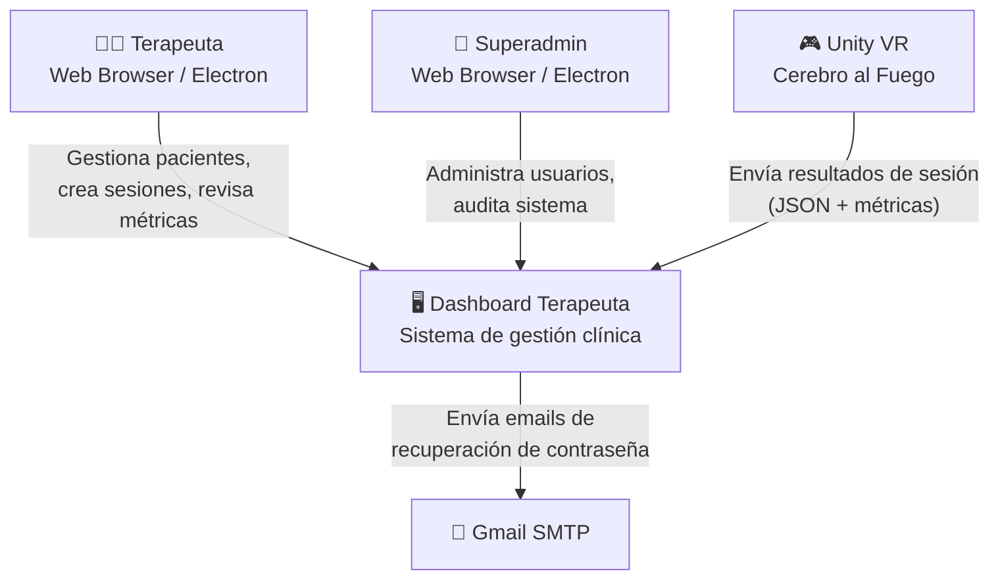
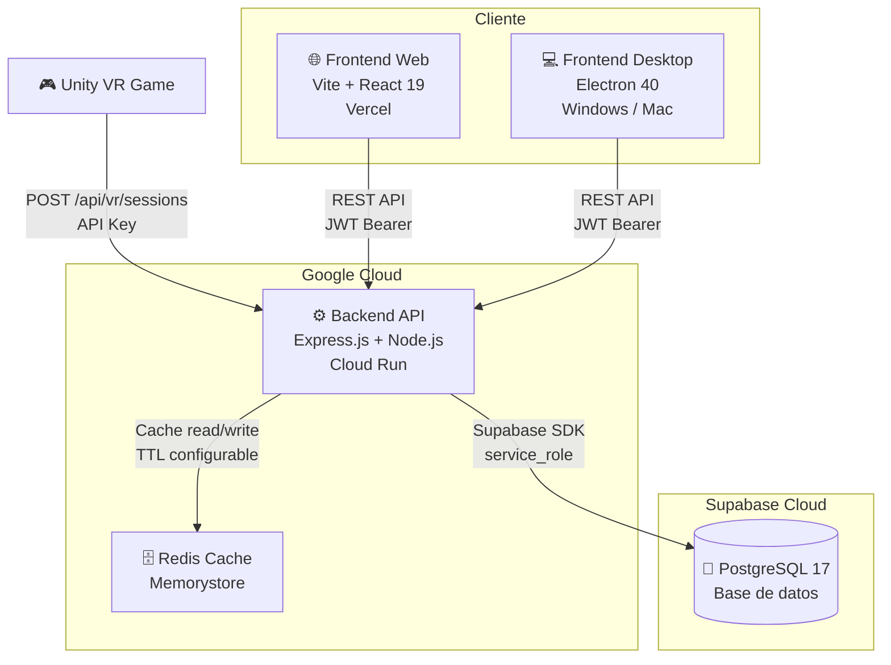
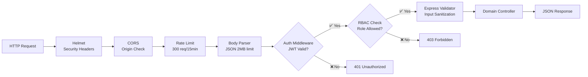
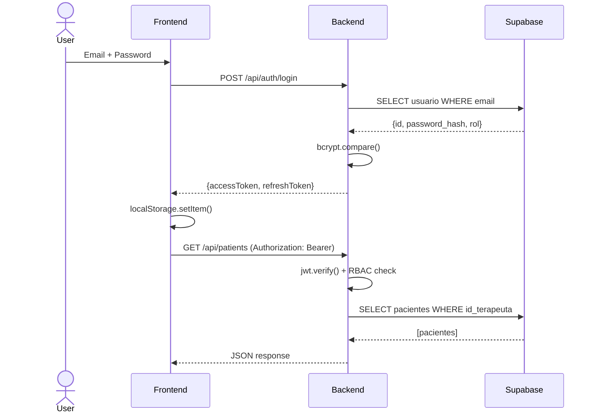
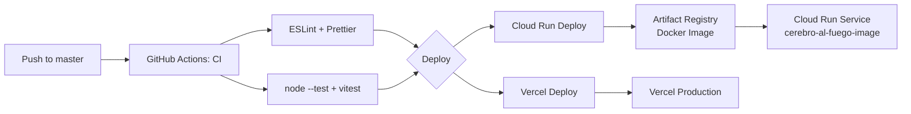

# Dashboard Terapeuta — Arquitectura Técnica

> **Versión**: 2.0 · **Fecha**: 2026-05-05  
> **Stack**: Express.js + React 19 + Vite + Electron 40 + Supabase PostgreSQL + Redis

---

## Resumen

Sistema distribuido con backend en **Google Cloud Run**, frontend dual-target (web en **Vercel** + desktop con **Electron**), base de datos en **Supabase PostgreSQL**, y comunicación asíncrona con el juego **Unity VR**.

---

## 1. Diagrama de Contexto (C4 Nivel 1)



---

## 2. Diagrama de Contenedores (C4 Nivel 2)



---

## 3. Backend: Arquitectura Modular

### 3.1 Estructura de Dominios

```
backend/src/
├── server.js              # Bootstrap: Express + Redis + Supabase
├── app.js                 # Configuración de Express
├── config/
│   └── supabase.js        # Cliente Supabase SDK
├── middleware/
│   ├── authMiddleware.js   # JWT verification + RBAC
│   ├── cacheMiddleware.js  # Redis TTL + bypass
│   └── requestContext.js   # requestId + logging
├── domains/
│   ├── auth/              # POST /api/auth/login, forgot-password, reset-password, register
│   ├── sessions/          # Sesiones de receta VR (CRUD, tokens)
│   ├── usuarios/          # Gestión de terapeutas (solo superadmin)
│   ├── vrResults/         # Ingesta Unity + revisión clínica
│   └── api/               # Health checks + docs
├── constants/
│   └── recipes.js         # VALID_RECIPE_IDS (9 valores)
├── utils/
│   ├── cache.js           # Cache helper (Redis wrapper)
│   ├── jwt.js             # Token generation/verification
│   ├── validators.js      # Validaciones reutilizables
│   └── hash.js            # bcrypt wrapper
└── services/              # Lógica de negocio (email, etc.)
```

### 3.2 Cadena de Middleware



### 3.3 Endpoints por Dominio

#### Auth (`/api/auth`)
| Método | Ruta | Auth | Descripción |
|---|---|---|---|
| `POST` | `/login` | No | Inicio de sesión. Retorna `accessToken` + `refreshToken`. |
| `POST` | `/register` | No (setup) | Registro del superadmin. Solo una vez. |
| `GET` | `/status` | No | Verifica si el sistema ya tiene superadmin. |
| `POST` | `/forgot-password` | No | Solicita código de recuperación por email. |
| `POST` | `/reset-password` | No | Cambia contraseña con código válido. |
| `POST` | `/refresh` | No (refreshToken) | Renueva accessToken. |

#### Usuarios (`/api/users` — solo SUPERADMIN)
| Método | Ruta | Auth | Descripción |
|---|---|---|---|
| `GET` | `/` | JWT + SUPERADMIN | Listar todos los usuarios (paginado). |
| `POST` | `/` | JWT + SUPERADMIN | Crear nuevo terapeuta. |
| `PUT` | `/:id` | JWT + SUPERADMIN | Actualizar usuario (activo, rol). |
| `DELETE` | `/:id` | JWT + SUPERADMIN | Desactivar usuario (soft). |

#### Pacientes (`/api/patients` — TERAPEUTA o SUPERADMIN)
| Método | Ruta | Descripción |
|---|---|---|
| `GET` | `/` | Listar pacientes del terapeuta (o todos si superadmin). |
| `GET` | `/:id` | Detalle de paciente con sesiones vinculadas. |
| `POST` | `/` | Crear paciente. |
| `PUT` | `/:id` | Actualizar datos del paciente. |
| `DELETE` | `/:id` | Archivar paciente (`activo=false`). |
| `PUT` | `/:id/assign` | Asignar paciente a terapeuta. |

#### Sesiones de Receta (`/api/sessions`)
| Método | Ruta | Descripción |
|---|---|---|
| `POST` | `/` | Crear sesión de receta (genera `start_token`). |
| `GET` | `/` | Listar sesiones (filtro por paciente, estado). |
| `GET` | `/:id` | Detalle de sesión. |
| `PUT` | `/:id/close` | Cerrar sesión manualmente. |

#### VR Results (`/api/vr/sessions`)
| Método | Ruta | Auth | Descripción |
|---|---|---|---|
| `GET` | `/:token` | No (token) | VR consulta sesión por `start_token`. |
| `POST` | `/` | API Key (Unity) | Unity envía resultados de sesión completos. |
| `GET` | `/` | JWT | Terapeuta lista sesiones VR (filtro por paciente, estado revisión). |
| `GET` | `/:id` | JWT | Detalle de sesión VR con sets y errores. |
| `PUT` | `/:id/review` | JWT | Terapeuta agrega observaciones clínicas. |

---

## 4. Frontend: Dual-Target Architecture

### 4.1 Estructura

```
frontend/src/
├── renderer/              # App React compartida
│   ├── App.jsx            # Router + providers
│   ├── pages/
│   │   ├── Login.jsx
│   │   ├── SetupPage.jsx       # Primer arranque superadmin
│   │   ├── ForgotPassword.jsx
│   │   ├── ResetPassword.jsx
│   │   ├── Dashboard.jsx       # Home con KPIs
│   │   ├── admin/              # Gestión de usuarios (superadmin)
│   │   └── terapeuta/          # Pacientes, sesiones, revisión
│   ├── components/
│   │   ├── layout/        # Navbar, Sidebar, Layout wrapper
│   │   ├── modals/        # Modales reutilizables
│   │   └── ui/            # Botones, inputs, cards
│   ├── context/           # AuthContext, ThemeContext
│   ├── services/          # api.js (axios client)
│   ├── constants/         # Rutas, labels de recetas
│   └── utils/             # Helpers, formatters
├── main/                  # Electron main process
├── preload/               # Electron preload scripts
├── web/                   # Entry point para Vercel/Vite

├── shared/                 # Tipos y utilidades compartidos
└── web/                    # Entry point para Vercel/Vite

### 4.2 Flujo de Autenticación



### 4.3 Páginas y Rutas

| Ruta | Página | Auth Requerida | Descripción |
|---|---|---|---|
| `/login` | Login.jsx | No | Inicio de sesión |
| `/setup` | SetupPage.jsx | No (solo si no hay superadmin) | Configuración inicial |
| `/forgot-password` | ForgotPassword.jsx | No | Solicitar recuperación |
| `/reset-password` | ResetPassword.jsx | No (con token válido) | Nueva contraseña |
| `/dashboard` | Dashboard.jsx | JWT | Inicio con KPIs |
| `/patients` | terapeuta/ | JWT (TERAPEUTA+) | Lista de pacientes |
| `/patients/:id` | terapeuta/ | JWT | Detalle de paciente |
| `/sessions` | terapeuta/ | JWT | Sesiones de receta |
| `/vr-sessions` | terapeuta/ | JWT | Sesiones VR (revisión) |
| `/vr-sessions/:id` | terapeuta/ | JWT | Detalle con métricas |
| `/users` | admin/ | JWT (solo SUPERADMIN) | Gestión de terapeutas |

---

## 5. Infraestructura y Despliegue

### 5.1 CI/CD Pipeline



### 5.2 Docker

```dockerfile
# Backend (Multi-stage)
FROM node:24-alpine AS builder
WORKDIR /app
COPY package*.json ./
RUN npm ci --production
COPY src/ ./src/
# Runtime
FROM node:24-alpine
COPY --from=builder /app /app
USER node
EXPOSE 3001
CMD ["node", "src/server.js"]
```

---

## 6. Decisiones Técnicas

| Decisión | Razón | Alternativa Considerada |
|---|---|---|
| **Supabase SDK** (no ORM) | Simplicidad, baja latencia, API REST nativa | Prisma, Knex, pg |
| **JWT propio** (no Supabase Auth) | Control total del flujo, evitar vendor lock-in | Supabase Auth, Auth0 |
| **bcryptjs** (no argon2) | Compatibilidad universal, sin dependencias nativas | argon2, scrypt |
| **Modular por dominio** | Escalabilidad, testabilidad, límites claros | Monolítico en server.js |
| **Dual-target frontend** | Misma app para web + escritorio sin duplicación | Apps separadas, PWA |
| **Redis opcional** | Cache sin punto único de fallo; fallback graceful | Solo Redis, sin caché |
| **Cloud Run** (no EC2/VM) | Serverless, auto-scale, zero idle cost | EC2, DigitalOcean, Railway |

---

## 📁 Documentos Relacionados

- [Requerimientos](./REQUERIMIENTOS.md) — Especificación funcional y no funcional
- [Modelo de Datos](./MODELO_DATOS.md) — Esquema y relaciones
- [Seguridad](./SEGURIDAD.md) — Auth, autorización, hardening
- [Integración VR](./INTEGRACION_VR.md) — Contrato Unity ↔ Dashboard
- [Despliegue](./DEPLOYMENT.md) — Infraestructura y CI/CD