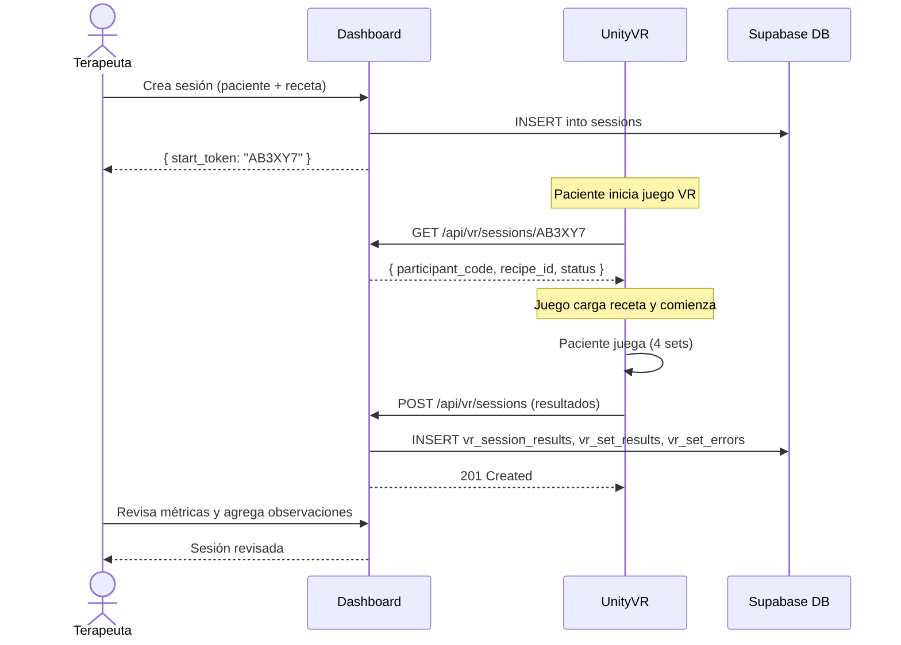

# Dashboard Terapeuta — Integración con Unity VR

> **Versión**: 2.0 · **Fecha**: 2026-05-05  
> **Juego**: Cerebro al Fuego (Unity) · **Protocolo**: REST JSON

---

## Resumen

El videojuego **Cerebro al Fuego** (desarrollado en Unity, proyecto independiente) se comunica con el Dashboard de Terapeuta a través de una API REST. El flujo es bidireccional: Unity consulta la sesión prescrita por el terapeuta y luego envía los resultados completos con métricas de desempeño cognitivo.

---

## 1. Diagrama de Secuencia



---

## 2. Endpoints del Contrato

### 2.1 Consultar Sesión por Token

Unity necesita saber qué receta cargar. Consulta con el `start_token` que el terapeuta generó.

```
GET /api/vr/sessions/{start_token}
```

**Headers**: Ninguno (no requiere autenticación JWT)

**Respuesta Exitosa (200)**:
```json
{
  "id": "550e8400-e29b-41d4-a716-446655440000",
  "participant_code": "1076543210",
  "recipe_id": "tinto",
  "status": "ACTIVE",
  "created_at": "2026-05-05T14:30:00Z"
}
```

**Errores**:
| Código | Causa |
|---|---|
| `404` | Token no encontrado o sesión ya finalizada |
| `400` | Token inválido (formato incorrecto) |

---

### 2.2 Enviar Resultados de Sesión

Unity envía el payload completo al finalizar la sesión VR.

```
POST /api/vr/sessions
```

**Headers**:
```
Content-Type: application/json
X-API-Key: {UNITY_API_KEY}
```

**Payload Esperado**:

```json
{
  "schemaVersion": "1.0",
  "participantId": "1076543210",
  "activityId": "tinto_easy_01",
  "startedAtIso": "2026-05-05T14:30:00.000Z",
  "endedAtIso": "2026-05-05T14:35:42.500Z",
  "totalSeconds": 342.5,
  "summary": {
    "totalErrors": 3,
    "totalDrops": 1,
    "totalReleases": 12,
    "setsCompleted": 4
  },
  "sets": [
    {
      "setName": "Reconocimiento",
      "setIndex": 0,
      "startedAtIso": "2026-05-05T14:30:00.000Z",
      "endedAtIso": "2026-05-05T14:31:15.000Z",
      "durationSeconds": 75.0,
      "blockedCount": 1,
      "dropsCount": 0,
      "releasesCount": 3,
      "errorsCount": 1,
      "errors": [
        {
          "code": "WRONG_INGREDIENT",
          "message": "Ingrediente incorrecto seleccionado",
          "timestampIso": "2026-05-05T14:30:45.000Z",
          "context": "Sal"
        }
      ]
    },
    {
      "setName": "Recolección",
      "setIndex": 1,
      "startedAtIso": "2026-05-05T14:31:15.000Z",
      "endedAtIso": "2026-05-05T14:32:45.000Z",
      "durationSeconds": 90.0,
      "blockedCount": 0,
      "dropsCount": 1,
      "releasesCount": 4,
      "errorsCount": 1,
      "errors": [
        {
          "code": "FORGOT_STEP",
          "message": "Paso omitido en la secuencia",
          "timestampIso": "2026-05-05T14:32:10.000Z",
          "context": "Cuchara"
        }
      ]
    },
    {
      "setName": "Preparación",
      "setIndex": 2,
      "startedAtIso": "2026-05-05T14:32:45.000Z",
      "endedAtIso": "2026-05-05T14:34:30.000Z",
      "durationSeconds": 105.0,
      "blockedCount": 2,
      "dropsCount": 0,
      "releasesCount": 3,
      "errorsCount": 1,
      "completion": {
        "coffeeAdded": true,
        "sugarAdded": true,
        "cupCoffeeAmount01": 0.85
      },
      "errors": [
        {
          "code": "SPILL",
          "message": "Líquido derramado",
          "timestampIso": "2026-05-05T14:33:20.000Z",
          "context": "Café"
        }
      ]
    },
    {
      "setName": "Organización",
      "setIndex": 3,
      "startedAtIso": "2026-05-05T14:34:30.000Z",
      "endedAtIso": "2026-05-05T14:35:42.500Z",
      "durationSeconds": 72.5,
      "blockedCount": 0,
      "dropsCount": 0,
      "releasesCount": 2,
      "errorsCount": 0,
      "returnedObjects": ["Cuchara", "Taza", "Plato"],
      "errors": []
    }
  ]
}
```

**Respuesta Exitosa (201)**:
```json
{
  "id": "660e8400-e29b-41d4-a716-446655440001",
  "status": "COMPLETED",
  "message": "Sesión registrada exitosamente"
}
```

**Errores**:
| Código | Causa |
|---|---|
| `401` | X-API-Key inválida o ausente |
| `400` | Payload malformado (`schemaVersion`, `sets` faltantes) |
| `422` | Validación fallida (ej: `total_seconds` negativo) |
| `413` | Payload excede 2MB |
| `409` | Sesión duplicada (mismo `participantId` + `activityId` + timestamp) |

---

## 3. Mapeo de Datos

### 3.1 Payload Unity → Tablas BD

| Campo Unity | Tabla BD | Columna |
|---|---|---|
| `participantId` | `vr_session_results` | `participant_id` |
| `activityId` | `vr_session_results` | `activity_id` |
| `startedAtIso` | `vr_session_results` | `started_at` |
| `endedAtIso` | `vr_session_results` | `ended_at` |
| `totalSeconds` | `vr_session_results` | `total_seconds` |
| `summary.totalErrors` | `vr_session_results` | `summary_total_errors` |
| `summary.totalDrops` | `vr_session_results` | `summary_total_drops` |
| `summary.totalReleases` | `vr_session_results` | `summary_total_releases` |
| `summary.setsCompleted` | `vr_session_results` | `summary_sets_completed` |
| Payload completo | `vr_session_results` | `raw_payload` (JSONB) |

### 3.2 Sets → vr_set_results

| Campo Unity (por set) | Columna BD |
|---|---|
| `setName` | `set_name` |
| `startedAtIso` | `started_at` |
| `endedAtIso` | `ended_at` |
| `durationSeconds` | `duration_seconds` |
| `blockedCount` | `blocked_count` |
| `dropsCount` | `drops_count` |
| `releasesCount` | `releases_count` |
| `errorsCount` | `errors_count` |

### 3.3 Errores → vr_set_errors

| Campo Unity (por error) | Columna BD |
|---|---|
| `code` | `code` |
| `message` | `message` |
| `timestampIso` | `occurred_at` |
| `context` | `objeto_contexto` |

---

## 4. Los 4 Sets (Etapas del Juego)

| # | Nombre | Descripción | Métricas Clave |
|---|---|---|---|
| 1 | **Reconocimiento** | Identificar ingredientes y utensilios correctos | Errores de selección |
| 2 | **Recolección** | Agarrar y mover objetos al área de trabajo | Drops, releases |
| 3 | **Preparación** | Seguir la receta en orden correcto | Completion (coffeeAdded, sugarAdded), errores de secuencia |
| 4 | **Organización** | Devolver objetos a su lugar original | Objetos retornados, orden |

---

## 5. Vinculación Automática Paciente

Cuando Unity envía `participantId`, el backend busca un paciente en la tabla `pacientes` cuya `identificacion` coincida. Si encuentra match, automáticamente completa `id_paciente_vinculado` en `vr_session_results`, permitiendo que el terapeuta vea la sesión en el contexto del paciente.

---

## 6. Consideraciones para Unity

### 6.1 Timeouts y Retries
- Timeout de conexión: **10 segundos**
- Retry en caso de error de red: hasta **3 intentos** con backoff exponencial (1s, 2s, 4s)
- No reintentar en errores 4xx (error del cliente/payload)

### 6.2 Validación Pre-envío
Antes de enviar, Unity debe validar:
1. `schemaVersion` siempre presente
2. `sets` es un array de exactamente 4 elementos
3. Timestamps en formato ISO 8601
4. Campos numéricos no negativos

### 6.3 Modo Offline
Si no hay conexión a internet, Unity debe:
1. Almacenar el payload localmente (PlayerPrefs o archivo JSON)
2. Reintentar envío en la próxima sesión con conexión
3. Marcar sesiones pendientes de envío en la UI del juego

---

## 📁 Documentos Relacionados

- [Requerimientos](./REQUERIMIENTOS.md)
- [Arquitectura Técnica](./ARQUITECTURA.md)
- [Modelo de Datos](./MODELO_DATOS.md)
- [Seguridad](./SEGURIDAD.md)
