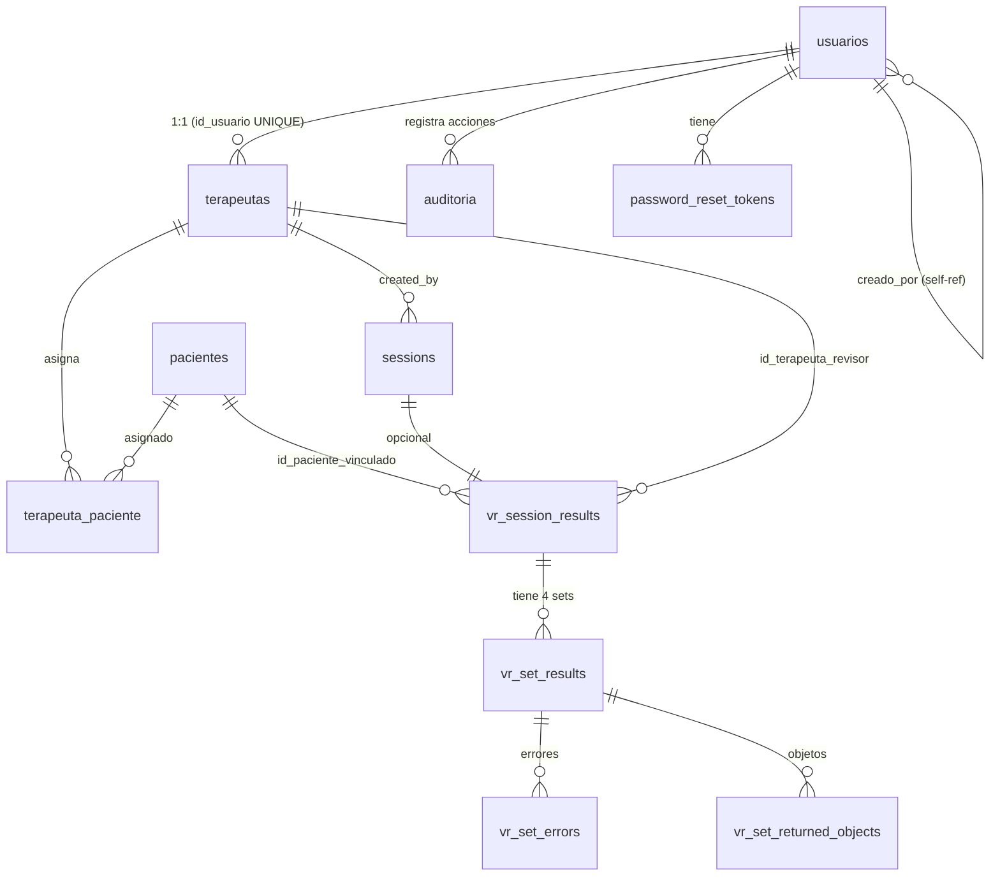

# Dashboard Terapeuta — Modelo de Datos

> **Versión**: 2.0 · **Motor**: PostgreSQL 17 · **Host**: Supabase

---

## Resumen

Base de datos relacional con **11 tablas** organizadas en 3 capas lógicas: identidad/usuarios, dominio clínico, y telemetría VR. Sin triggers automáticos de Supabase Auth — toda la lógica se controla desde la API.

---

## 1. Diagrama Entidad-Relación

---

## 2. Diccionario de Tablas

### 2.1 usuarios

Centro de identidad. Toda autenticación y autorización parte de esta tabla.

| Columna | Tipo | Restricciones | Descripción |
|---|---|---|---|
| `id` | `SERIAL` | PK | Identificador autoincremental |
| `email` | `VARCHAR(255)` | UNIQUE, NOT NULL | Correo de inicio de sesión |
| `password_hash` | `TEXT` | NOT NULL | bcrypt hash (salt rounds = 10) |
| `rol` | `VARCHAR(20)` | CHECK (SUPERADMIN, TERAPEUTA) | Rol RBAC |
| `activo` | `BOOLEAN` | DEFAULT true | Soft-delete |
| `fecha_creacion` | `TIMESTAMP` | DEFAULT NOW() | Fecha de registro |
| `ultimo_login` | `TIMESTAMP` | NULLABLE | Último acceso exitoso |
| `creado_por` | `INTEGER` | FK → usuarios(id) | Self-referencia (admin crea terapeutas) |

### 2.2 terapeutas

Extensión del perfil de usuario TERAPEUTA con datos profesionales.

| Columna | Tipo | Restricciones | Descripción |
|---|---|---|---|
| `id` | `SERIAL` | PK | |
| `id_usuario` | `INTEGER` | FK → usuarios(id), UNIQUE | 1:1 con usuarios |
| `nombre` | `VARCHAR(255)` | NOT NULL | Nombre completo |
| `especialidad` | `VARCHAR(255)` | NULLABLE | Neuropsicología, Geriatría, etc. |
| `correo` | `VARCHAR(255)` | NULLABLE | Email de contacto profesional |
| `telefono` | `VARCHAR(50)` | NULLABLE | Celular colombiano |

### 2.3 pacientes

Pacientes adultos mayores con datos clínicos.

| Columna | Tipo | Restricciones | Descripción |
|---|---|---|---|
| `id` | `SERIAL` | PK | |
| `identificacion` | `VARCHAR(50)` | UNIQUE | Cédula colombiana |
| `nombre` | `VARCHAR(255)` | NOT NULL | Nombre completo |
| `edad` | `INTEGER` | CHECK (> 0) | 60-85 años típico |
| `diagnostico` | `TEXT` | NULLABLE | DCL, Alzheimer, Parkinson, etc. |
| `fecha_registro` | `DATE` | DEFAULT TODAY | |
| `activo` | `BOOLEAN` | NOT NULL DEFAULT true | Archivo lógico |

### 2.4 terapeuta_paciente

Tabla de asociación: vincula pacientes con su terapeuta tratante.

| Columna | Tipo | Restricciones | Descripción |
|---|---|---|---|
| `id` | `SERIAL` | PK | |
| `id_terapeuta` | `INTEGER` | FK → terapeutas(id), NOT NULL | |
| `id_paciente` | `INTEGER` | FK → pacientes(id), NOT NULL | |
| `fecha_asignacion` | `DATE` | DEFAULT TODAY | |
| `estado` | `VARCHAR(20)` | CHECK (ACTIVO, FINALIZADO) | |

### 2.5 password_reset_tokens

Códigos de recuperación de contraseña con expiración.

| Columna | Tipo | Restricciones | Descripción |
|---|---|---|---|
| `id` | `SERIAL` | PK | |
| `id_usuario` | `INTEGER` | FK → usuarios(id), CASCADE | |
| `token` | `VARCHAR(64)` | UNIQUE, NOT NULL | Código de 6 dígitos |
| `expires_at` | `TIMESTAMP` | NOT NULL | Expira en 10 minutos |
| `used` | `BOOLEAN` | DEFAULT false | |
| `created_at` | `TIMESTAMP` | DEFAULT NOW() | |

### 2.6 sessions

Sesiones de receta VR creadas por el terapeuta.

| Columna | Tipo | Restricciones | Descripción |
|---|---|---|---|
| `id` | `UUID` | PK, gen_random_uuid() | |
| `participant_code` | `VARCHAR(50)` | NOT NULL | ID del paciente (identificacion) |
| `recipe_id` | `VARCHAR(100)` | CHECK (9 valores) | Receta a cargar en VR |
| `status` | `VARCHAR(20)` | CHECK (CREATED, ACTIVE, FINISHED) | |
| `start_token` | `VARCHAR(8)` | UNIQUE, NOT NULL | Token de 6 chars para VR |
| `created_by` | `INTEGER` | FK → terapeutas(id) | |
| `created_at` | `TIMESTAMPTZ` | DEFAULT NOW() | |

**Índices**: `ix_sessions_start_token`, `ix_sessions_participant_code`, `ix_sessions_status`  
**Índice parcial**: `ix_sessions_one_active_per_participant` (UNIQUE WHERE status='ACTIVE')

### 2.7 vr_session_results

Resultado completo de una sesión VR enviado por Unity.

| Columna | Tipo | Restricciones | Descripción |
|---|---|---|---|
| `id` | `UUID` | PK, gen_random_uuid() | |
| `schema_version` | `TEXT` | NOT NULL | Versión del payload |
| `participant_id` | `TEXT` | NOT NULL | ID del jugador VR |
| `activity_id` | `TEXT` | NOT NULL | Actividad (ej: tinto_easy_01) |
| `started_at` | `TIMESTAMPTZ` | NOT NULL | Inicio de sesión |
| `ended_at` | `TIMESTAMPTZ` | NOT NULL | Fin de sesión |
| `total_seconds` | `DOUBLE PRECISION` | CHECK (>= 0) | Duración |
| `summary_total_errors` | `INTEGER` | DEFAULT 0, CHECK (>= 0) | Errores totales |
| `summary_total_drops` | `INTEGER` | DEFAULT 0, CHECK (>= 0) | Objetos caídos |
| `summary_total_releases` | `INTEGER` | DEFAULT 0, CHECK (>= 0) | Objetos soltados |
| `summary_sets_completed` | `INTEGER` | DEFAULT 0, CHECK (>= 0) | Sets completados |
| `raw_payload` | `JSONB` | NOT NULL | Payload original Unity |
| `id_paciente_vinculado` | `INTEGER` | FK → pacientes(id) | Match con paciente |
| `id_terapeuta_revisor` | `INTEGER` | FK → terapeutas(id) | Quién revisó |
| `observaciones_terapeuta` | `TEXT` | NULLABLE | Notas clínicas |
| `estado_revision` | `VARCHAR(50)` | DEFAULT PENDIENTE_REVISION | |
| `created_at` | `TIMESTAMPTZ` | DEFAULT NOW() | |

### 2.8 vr_set_results

Métricas de cada uno de los 4 sets (etapas) de una sesión VR.

| Columna | Tipo | Restricciones | Descripción |
|---|---|---|---|
| `id` | `UUID` | PK | |
| `session_id` | `UUID` | FK → vr_session_results, CASCADE | |
| `set_name` | `TEXT` | NOT NULL | Reconocimiento, Recolección, Preparación, Organización |
| `started_at` | `TIMESTAMPTZ` | NOT NULL | |
| `ended_at` | `TIMESTAMPTZ` | NOT NULL | |
| `duration_seconds` | `DOUBLE PRECISION` | CHECK (>= 0) | |
| `blocked_count` | `INTEGER` | DEFAULT 0, CHECK (>= 0) | |
| `drops_count` | `INTEGER` | DEFAULT 0, CHECK (>= 0) | |
| `releases_count` | `INTEGER` | DEFAULT 0, CHECK (>= 0) | |
| `errors_count` | `INTEGER` | DEFAULT 0 | |
| `created_at` | `TIMESTAMPTZ` | DEFAULT NOW() | |

**Constraint**: `uq_vr_set_results_session_set` UNIQUE (session_id, set_name)

### 2.9 vr_set_errors

Errores individuales cometidos durante un set.

| Columna | Tipo | Descripción |
|---|---|---|
| `id` | `UUID` | PK |
| `set_id` | `UUID` | FK → vr_set_results, CASCADE |
| `code` | `TEXT` | WRONG_INGREDIENT, WRONG_ORDER, SPILL, BURNT_FOOD, etc. |
| `message` | `TEXT` | Descripción legible |
| `occurred_at` | `TIMESTAMPTZ` | Timestamp del error |
| `objeto_contexto` | `TEXT` | Objeto asociado (ej: Sal, Estufa) |
| `created_at` | `TIMESTAMPTZ` | |

### 2.10 vr_set_returned_objects

Objetos que el paciente devolvió a su lugar (etapa Organización).

| Columna | Tipo | Descripción |
|---|---|---|
| `id` | `UUID` | PK |
| `set_id` | `UUID` | FK → vr_set_results, CASCADE |
| `object_name` | `TEXT` | Cuchara, Taza, Plato, etc. |
| `created_at` | `TIMESTAMPTZ` | |

### 2.11 auditoria

Registro inmutable de acciones sensibles.

| Columna | Tipo | Descripción |
|---|---|---|
| `id` | `SERIAL` | PK |
| `id_usuario` | `INTEGER` | FK → usuarios(id) |
| `tipo_accion` | `VARCHAR(100)` | LOGIN_SUCCESS, PATIENT_CREATED, etc. |
| `fecha` | `TIMESTAMP` | |
| `descripcion` | `TEXT` | JSON con detalle + IP + metadata |

---

## 3. Valores Enumerados (CHECK Constraints)

### Roles
`SUPERADMIN` · `TERAPEUTA`

### Estados de Sesión
`CREATED` · `ACTIVE` · `FINISHED`

### Estados de Revisión
`PENDIENTE_REVISION` · `REVISADA`

### Recetas VR (9 valores)
| Dificultad | Recetas |
|---|---|
| Fácil | `tinto`, `cafe_con_leche`, `macchiato` |
| Intermedio | `arepa_con_huevo`, `panqueques_con_frutas`, `avena_con_toppings` |
| Difícil | `arroz_con_pollo`, `spaghetti_bolognesa`, `sancocho_de_res` |

### Códigos de Error VR
`WRONG_INGREDIENT` · `WRONG_ORDER` · `STOVE_ON_NO_POT` · `SPILL` · `BURNT_FOOD` · `FORGOT_STEP` · `WRONG_UTENSIL`

---

## 📁 Documentos Relacionados

- [Requerimientos](./REQUERIMIENTOS.md) — Especificación funcional
- [Arquitectura Técnica](./ARQUITECTURA.md) — Diseño del sistema
- [Seguridad](./SEGURIDAD.md) — Auth y hardening
- [Integración VR](./INTEGRACION_VR.md) — Contrato Unity ↔ Dashboard
